<div align="center">

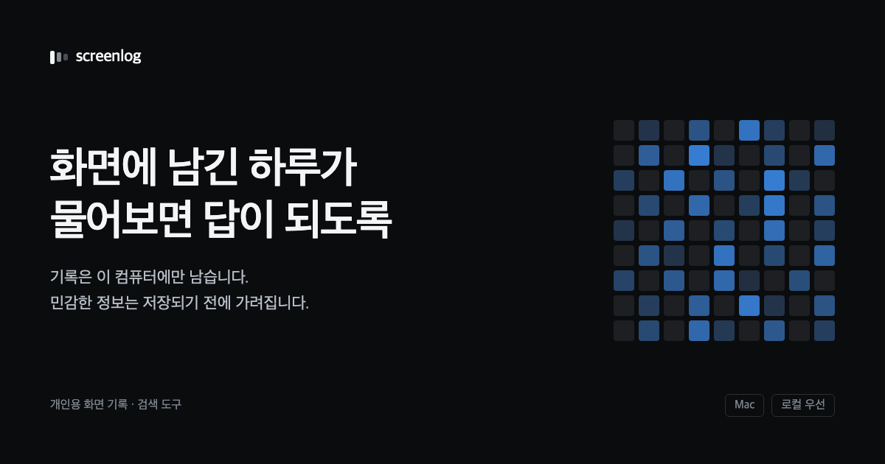

# screenlog

**내 화면 기록에 물어보면 근거와 함께 답하는 개인용 RAG.**

**Backend**<br/>


**AI / RAG**<br/>


**Infra**<br/>


<table align="center">
<tr>
<td align="center" width="210"><h2>0.99</h2><b>검색 recall@8</b><br/><sub>골든셋 25문항 직접 라벨링</sub></td>
<td align="center" width="210"><h2>1.4초</h2><b>첫 응답 · 5.3초에서</b><br/><sub><code>as_completed</code> — 캐시 적중과 무관</sub></td>
<td align="center" width="210"><h2>−97.7%</h2><b>하루 요약 프롬프트</b><br/><sub>100만 자 → 2.3만 자</sub></td>
</tr>
</table>

</div>

---

[screenpipe](https://github.com/mediar-ai/screenpipe)가 몇 초마다 찍어둔 화면 기록을 읽어서,
한국어 질문에 근거와 함께 답한다. **수집·정제·임베딩·검색·라우팅·요약·에이전트·서빙·배포가
전부 이 저장소 안에 있고, 원본 데이터는 이 컴퓨터를 떠나지 않는다.**

**핵심 성과 — 문제 → 해결 → 결과**

- **대기 시간**: 여러 날짜를 `asyncio.gather`로 묶으니 *가장 느린 하루*가 전체 응답을 결정해
  그때까지 화면이 비어 있었다 → `asyncio.as_completed`로 먼저 끝난 날짜부터 스트리밍 →
  **첫 응답 5.3초 → 1.4초(−74%)**. 캐시 적중과 무관하게 항상 재현된다.
- **검색 품질**: "검색이 정답을 가져오는지" 잴 방법이 없었다 → **골든셋 25문항을 직접
  라벨링**하고 recall@k를 실측 → `RETRIEVE_K` 10→8, **recall 1%p를 내주고 프롬프트 근거 20% 절감**.
- **비용/안정성**: 이벤트가 많은 날 하루 요약 프롬프트가 **1,005,356자**로 터졌다 →
  앞자르기 대신 균등 솎아내기(`_thin_out()`) + 개수 상한 → **22,730자(−97.7%)**, 하루 전체 커버는 유지.
- **정확도**: 사용 횟수를 LLM에 맡겼더니 **실제 340회를 "5회"로** 답했다 → 집계는 LLM을 빼고
  metadata를 코드가 직접 셈 → **실측 카운트와 정확히 일치**, 에이전트가 도구를 어떤 순서로 불러도 안 깨짐.

| | |
|---|---|
| **기간 / 역할** | 개인 프로젝트 · 1인 개발 · 커밋 68개 (2026-07-28 ~ 08-06) |
| **색인 데이터** | 이벤트 **30,521개** / 15일치(2026-07-22 ~ 08-05) / 캡처 프레임 55,188개 / 앱 27종 / 벡터 DB 688MB |
| **결과물** | 웹 서비스(랜딩·질의·탐색) + 로컬 수집·동기화 Mac 앱(.dmg) + GitHub Actions → GHCR → EC2 자동 배포 |


> 실험 원문·실패한 시도·기각한 결론까지
> [`docs/`](docs)와 [`eval/`](eval)에 남아 있다. → [문서 지도](#docs-map) ·
> 설치와 실행은 맨 아래 [빠른 시작](#quick-start).

---

## 📺 데모 영상

<div align="center">

[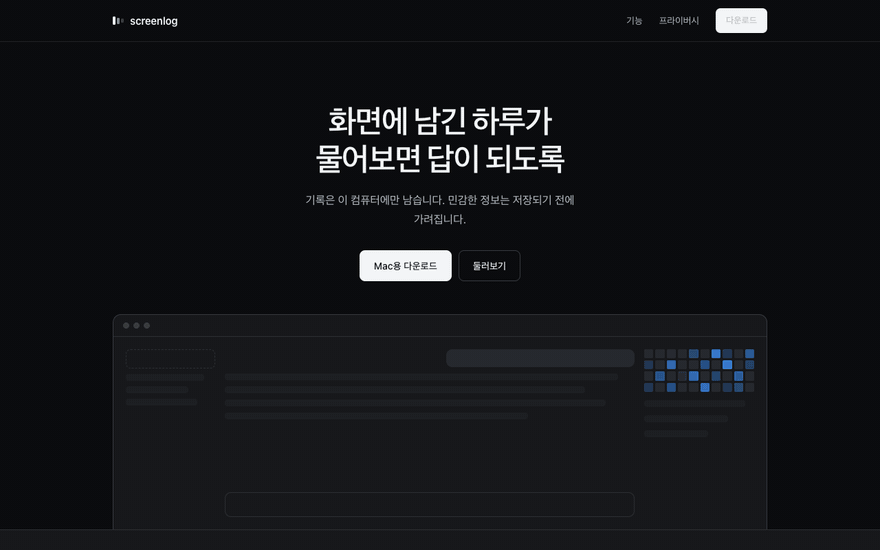](docs/video/screenlog-recap.mp4)

**[▶ 2분 요약본](docs/video/screenlog-recap.mp4)** · **[▶ 전체본](docs/video/screenlog-full.mp4)**

<sub>랜딩 → 설치 안내 → 탐색 → 물어보기 → 답변까지 실제 동작. 편집·가속 없음.</sub>

</div>

---

## 목차

| | |
|---|---|
| **소개** | [1. 왜 만들었나](#why) · [2. 무엇을 하는가](#what) |
| **설계** | [3. 시스템 구조](#architecture) · [4. 파이프라인](#pipeline) |
| **검증** | [5. 평가](#evaluation) · [6. 핵심 설계 결정](#decisions) · [7. 트러블슈팅](#troubleshooting) · [8. 성능](#performance) |
| **운영** | [9. 웹 서비스와 API](#web-api) · [10. 배포](#deployment) · [11. 개인정보](#privacy) |
| **그 외** | [12. 알려진 한계](#limitations) · [13. 문서 지도](#docs-map) · [14. 빠른 시작](#quick-start) |

---

<a id="why"></a>

## 🎯 1. 왜 만들었나

금요일마다 주간 공유를 쓸 때가 제일 막막했다. 분명 바빴는데 뭘 했는지가 기억이 안 나서,
커밋 로그와 브라우저 히스토리를 한참 역추적하고 나서야 겨우 몇 줄을 적었다. **하루 종일
화면을 보며 일했는데, 정작 그 기록은 어디에도 남아 있지 않았다.**

화면 기록 자체는 쌓을 수 있는 방법이 있었다.([screenpipe](https://github.com/mediar-ai/screenpipe)).
이 프로젝트는 **꺼내는 쪽**에 집중했다.

**1. 기록은 있는데 질문으로 못 꺼낸다.** screenpipe가 제공하는 검색은 FTS5 키워드 매칭이다.
화면에 영어로 "Commit 타입"이라고 찍혀 있으면 "커밋 컨벤션"이라는 질문으로는 안 잡힌다 —

"어제 뭐 했지", "이번 주 언제가 제일 바빴어", "카톡 몇 번 켰어" 같은 질문은 **애초에 키워드로 표현할 수 있는 형태가 아니다.**
날짜를 해석하고, 하루를 요약하고, 날짜를 가로질러 비교하고, 세어야 답이 나온다고 판단했다.

**2. 그렇다고 화면을 통째로 남에게 맡길 수는 없다.** 화면 기록에는 메신저 대화와 로그인
화면이 그대로 들어있다. 업로드형 상용 서비스는 "무엇이 올라가는지"를 내가 통제할 수 없어서
이 데이터에는 쓸 수 없는 선택지였다. **개인정보가 기능이 아니라 제약으로 먼저 있었고,
아키텍처가 거기에 맞춰졌다.**

**3. 원하는 건 검색 결과가 아니라 맥락의 복원이었다.** 주간 공유에 붙일 수 있는 건 링크
목록이 아니라 문장이다. "그때 뭘 하다 말았지"를 다시 이어서 하려면 더더욱 그렇다. 그래서
검색 위에 **인수인계 문서**와 **슬랙 공유 초안**을 출력 양식으로 올렸다.

| 제약 | 어떻게 지켰나 |
|---|---|
| **원본은 이 컴퓨터를 떠나지 않는다** | 수집 단계에서 PII 리덕션을 켜고 리덕션본을 `mode=ro`로만 읽는다. 화면 캡처·오디오 원본과 프레임 DB는 로컬에만 남고, 임베딩을 로컬에서 끝낸 뒤 서버로는 리덕션된 텍스트와 그 벡터만 올린다 |
| **답에는 항상 근거가 붙는다** | `search()`와 `ask()`를 일부러 분리했다 — 합쳐두면 엉뚱한 걸 가져와도 그럴듯한 답이 나와서 눈치채지 못한다. UI·CLI·API 모두 답과 근거를 같이 낸다 |
| **언제든 갈아끼울 수 있어야 한다** | LLM은 `USE_LOCAL_LLM` → `OPENAI_API_KEY` → `ANTHROPIC_API_KEY` 3중 스위치. 환경변수 한 줄로 **완전 로컬(Ollama)까지 내려간다** — 그 경로를 8문항 × 밀도가 다른 5일로 API와 정면 비교했다 |

> **정직하게 적자면**, 기본 구성에서 외부로 나가는 것은 LLM 호출뿐이고 그때 근거 텍스트가
> 프롬프트에 실린다. 그것마저 원치 않으면 `USE_LOCAL_LLM=1`로 완전 로컬 동작이 가능하고,
> 그게 [로컬 LLM 실험](docs/local-llm-experiment-report.md)을 진행한 이유이다.

---

<a id="what"></a>

## 💬 2. 무엇을 하는가

평소 말투로 물어보면 **필터를 스스로 뽑아** 그 범위 안에서만 답한다.
질문을 던지면 라우팅 결과(`Google Chrome에서 · 최근 7일`)가 먼저 뜨고 답이 토큰 단위로 흘러나온다.

<table>
<tr>
<td width="50%">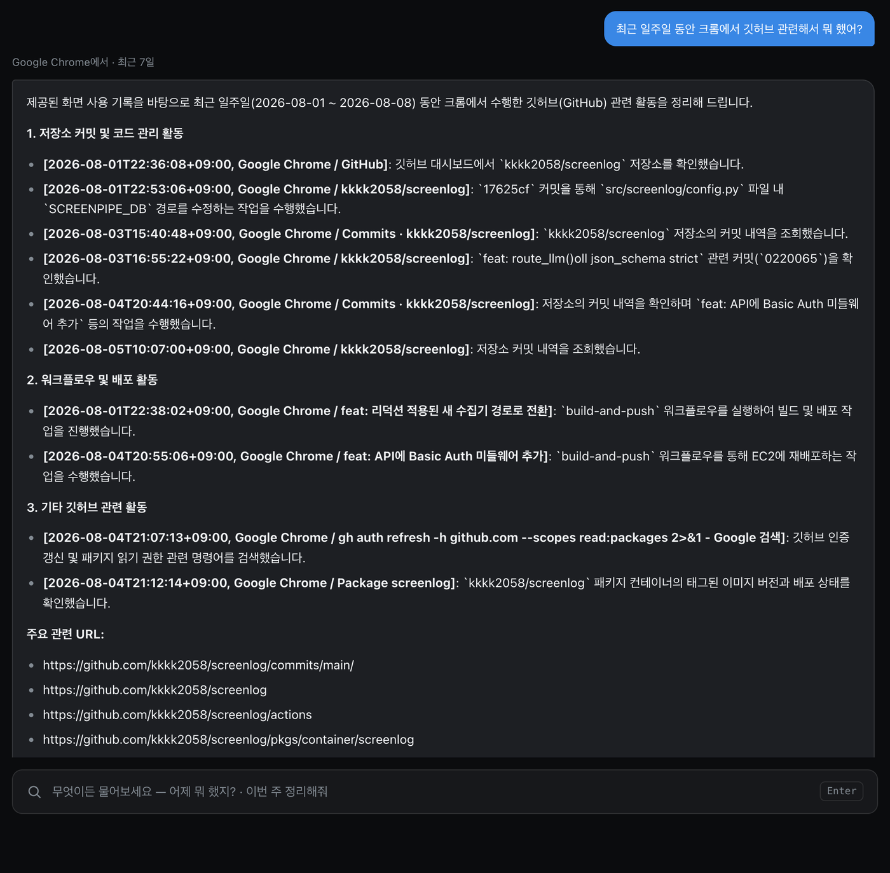</td>
<td width="50%">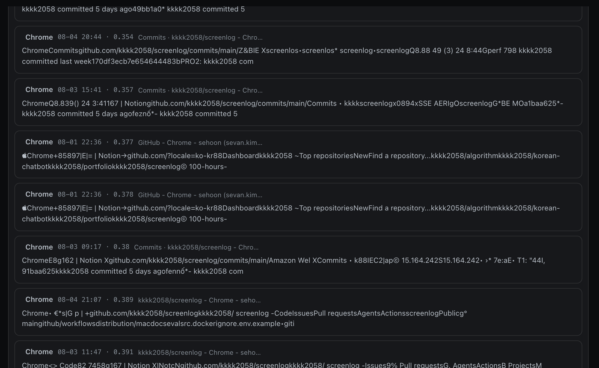</td>
</tr>
<tr>
<td><b>답변</b> — 질문 아래에 라우팅 결과를 배지로 보여주고, 각 항목에 <b>캡처 시각 · 앱 · 창 제목 ·
실제 URL</b>을 그대로 붙인다.</td>
<td><b>근거</b> — 답의 출처가 된 이벤트를 거리 점수와 함께 펼쳐볼 수 있다. 화면에서 읽힌 <b>원문
그대로</b>라 OCR 노이즈까지 사용자가 직접 검증할 수 있다.</td>
</tr>
</table>


질문은 한 종류가 아니다. 

**같은 파이프라인으로 처리하면 전부 틀린다**는 걸 확인하고,
답을 만드는 방식을 다섯 갈래로 나눴다.

| 유형 | 예시 | 답을 만드는 방식 | 구현 |
|---|---|---|---|
| **검색** | "코드트리에서 뭐 풀었어?" | 벡터 검색 top-k → LLM이 근거로 답변 | [`ask.py`](src/screenlog/ask.py) |
| **정리** | "어제 하루 정리해줘" | 날짜별 요약을 병렬 생성해 먼저 끝난 것부터 스트리밍 | [`summarize.py`](src/screenlog/summarize.py) |
| **비교** | "이번 주 언제가 제일 바빴어?" | 날짜별 요약 → 그 요약들을 다시 LLM으로 비교 | [`summarize.py`](src/screenlog/summarize.py) |
| **집계** | "카톡 몇 번 켰어?" | **LLM을 안 거친다.** metadata를 코드가 직접 센다 | [`count_range()`](src/screenlog/summarize.py) |
| **복합** | "유튜브 몇 번 봤는지랑 뭐 봤는지 같이" | ReAct 에이전트가 위 도구들을 골라 조합 | [`agent.py`](src/screenlog_langgraph/agent.py) |

여기에 **인수인계 문서**·**슬랙 공유 초안** 두 가지 출력 양식이 에이전트 도구로 얹혀 있다.
슬랙은 초안까지만 만들고, 실제 전송은 사용자가 버튼을 눌러야만 도는 별도 엔드포인트다.

### 기능 상세

<table>
<tr>
<th width="50%">검색 — 근거 8개가 같이 나온다</th>
<th width="50%">정리 — 하루를 시각순으로 복원</th>
</tr>
<tr>
<td>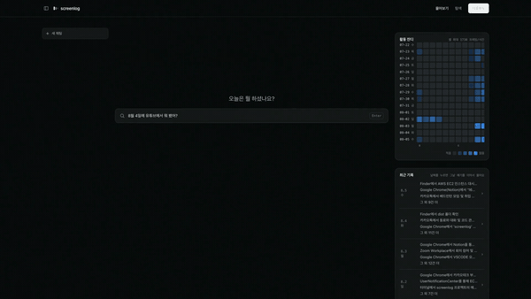</td>
<td>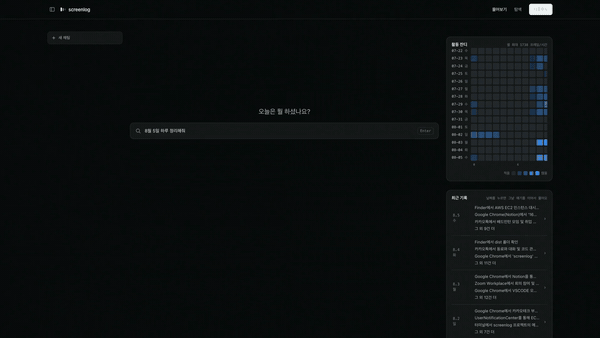</td>
</tr>
<tr>
<td><sub>라우팅 결과가 배지로 먼저 뜨고, 답 아래에 <b>캡처 시각 · 앱 · 창 제목 · 거리 점수</b>가 그대로 붙는다. 화면에서 읽힌 원문이라 OCR 노이즈까지 검증된다.</sub></td>
<td><sub>유튜브·Notion·카카오톡·터미널이 <b>한 줄기로</b> 이어진다. 날짜별 요약을 병렬 생성해 먼저 끝난 것부터 스트리밍 — 첫 문장이 1.4초.</sub></td>
</tr>

<tr>
<th>비교 — 날짜를 가로지르는 질문</th>
<th>인수인계 — 같은 기록, 다른 양식</th>
</tr>
<tr>
<td>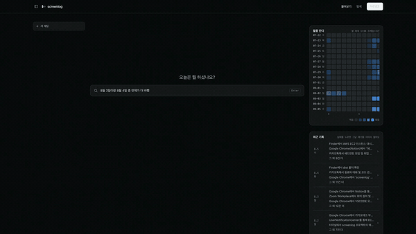</td>
<td></td>
</tr>
<tr>
<td><sub>날짜별 요약을 각각 만든 뒤 <b>그 요약들을 다시 LLM에 넣어</b> 판단시킨다. 나열만 해서는 "어느 날이 더 바빴나"에 답이 안 나온다.</sub></td>
<td><sub><b>진행한 작업 / 이어서 할 것 / 참고할 점</b> 세 갈래로 다시 쓴다. "그때 뭘 하다 말았지"를 이어서 하려면 검색 결과가 아니라 문장이 필요했다.</sub></td>
</tr>

<tr>
<th>슬랙 초안 — 전송은 사람이</th>
<th>집계 — LLM을 한 번도 안 부른다</th>
</tr>
<tr>
<td></td>
<td>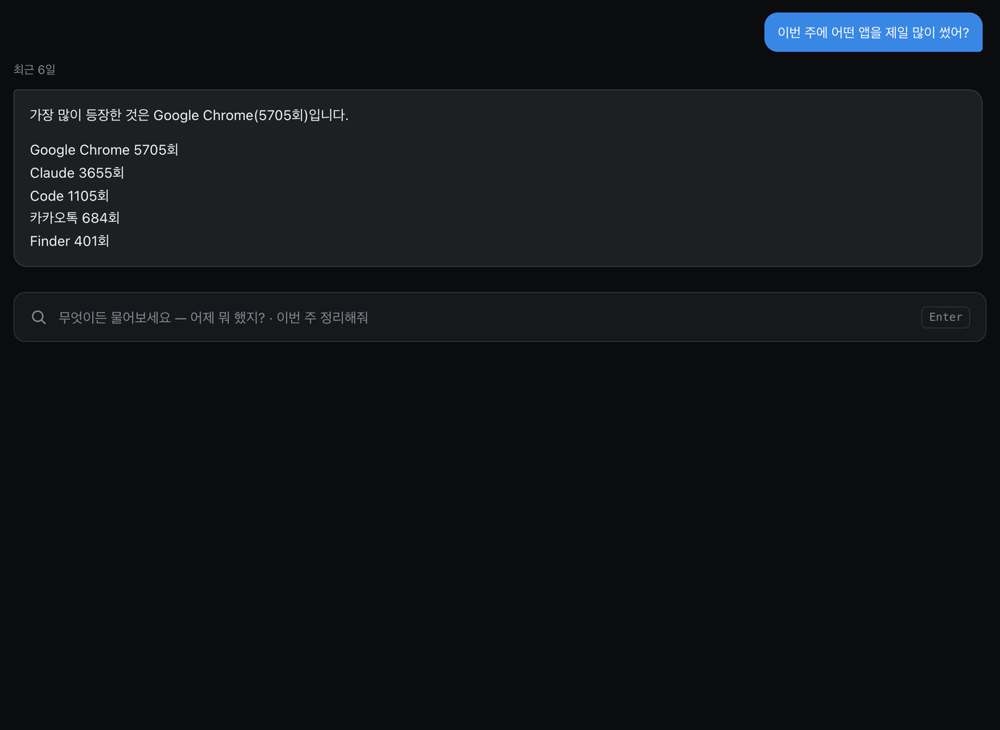</td>
</tr>
<tr>
<td><sub>"방금 그거"라고만 해도 <b>직전 답변을 코드가 그대로 가져와</b> 재포맷한다 — LLM이 필터를 다시 추론하다 무관한 내용을 만든 사고가 있어서다. 실제 전송은 사용자가 버튼을 눌러야만 도는 별도 엔드포인트.</sub></td>
<td><sub><code>count_range()</code>가 chroma metadata를 직접 세서 문자열만 조합한다. 요약문을 읽고 LLM이 세게 하면 <b>실제 340회를 "5회"로</b> 답하는 사고가 난다(실측).</sub></td>
</tr>
</table>

<details>
<summary><b>정적 화면으로 더 보기 — 유형별 실제 응답 3건</b></summary>

<br>

**집계 — "이번 주에 어떤 앱을 제일 많이 썼어?"**


**LLM을 한 번도 안 부른 답이다.** `count_range()`가 chroma metadata를 직접 세서 문자열만
조합한다. 요약문을 읽고 LLM이 세게 하면 실제 340회를 "5회"로 답하는 사고가 난다(실측).

<br>

**비교 — "8월 3일이랑 8월 4일 중 언제가 더 바빴어?"**

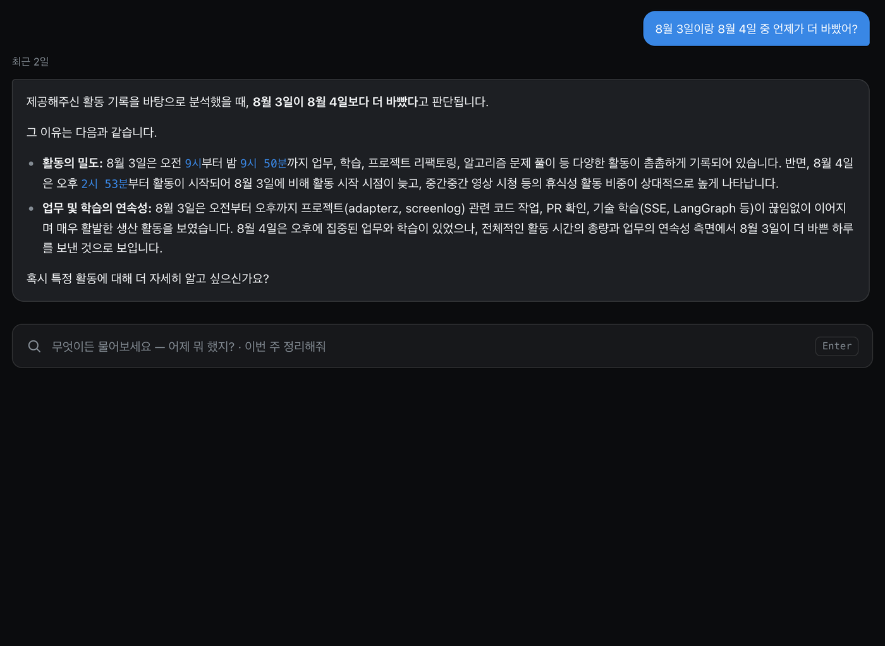

날짜별 요약을 **각각 만든 뒤 그 요약들을 다시 LLM에 넣어** 판단시킨다. 요약을 나열만 해서는
"어느 날이 더 바빴나"라는 날짜를 가로지르는 질문에 답이 안 나온다. 근거로 든 시간대와
활동을 짚으면서 결론을 낸다.

<br>

**복합 — "이번주에 깃허브 몇 번 봤는지랑 어떤 작업 했는지 같이 알려줘"**

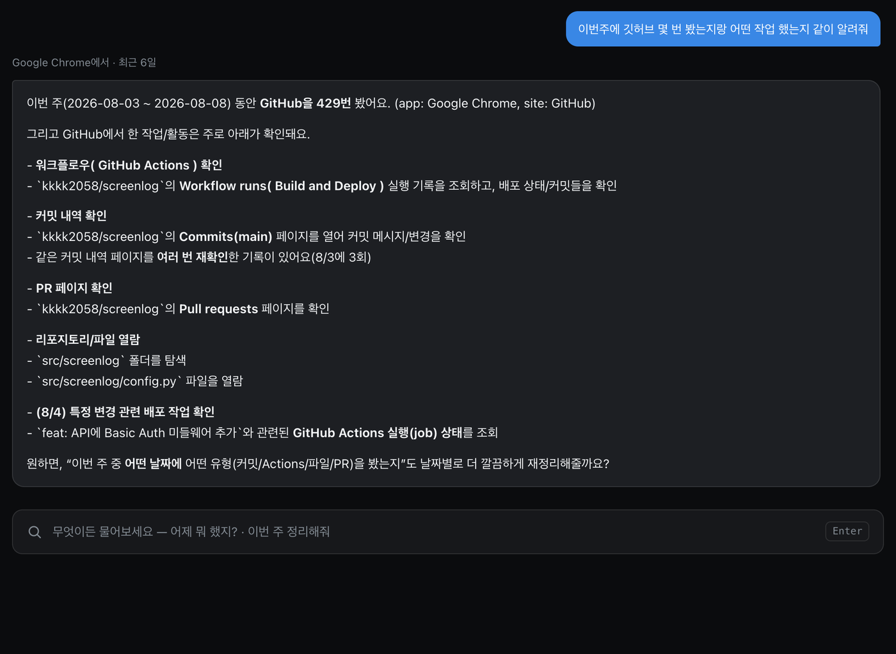

집계와 검색이 **동시에** 필요해서 네 갈래 중 하나로는 못 푸는 질문이다. `route()`가
`compound=true`로 표시하면 ReAct 에이전트가 `count_events`(429회)와 `search_events`를
차례로 부른 뒤 하나의 답으로 합친다.

</details>

---

<a id="architecture"></a>

## 🏗 3. 시스템 구조

> **한 줄 요약** — 화면을 찍고 · 걸러내고 · 이해할 수 있는 형태로 쌓는 일까지 전부 자동으로
> 돌아가고, 사용자는 **"어제 뭐 했지?"라고 평소 말투로 묻기만 하면 1.4초 안에 첫 문장을
> 근거와 함께 받는다.** 원본 기록은 그동안 내 컴퓨터 밖으로 나가지 않는다.

**사용자가 실제로 하는 일은 세 가지뿐이다** — ① 메뉴바 앱에서 녹화를 켜둔다 → ② 하루 끝에
"동기화"를 누른다(색인·요약·전송이 알아서 돈다) → ③ 웹에서 묻는다. 아래 다이어그램의
나머지 전부가 이 세 동작 뒤에서 자동으로 처리되는 부분이다.

<div align="center">

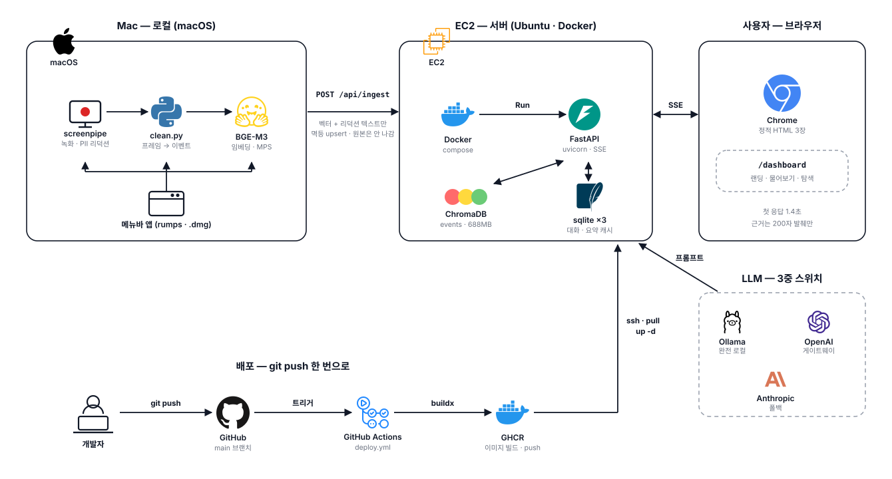

</div>

<details>
<summary><b>데이터 흐름 상세 — 수집 · 색인 · 질의 · 서빙</b></summary>

<br>

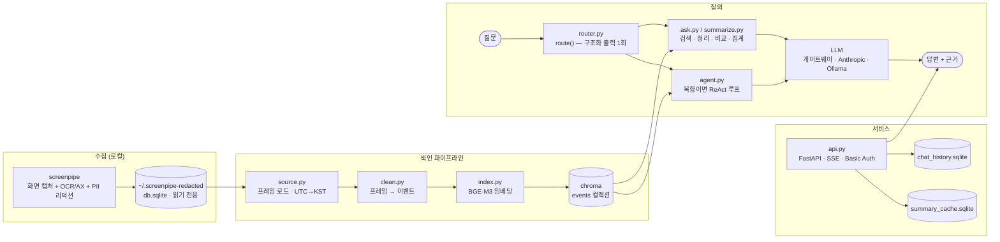

</details>

### 기술 선택과 이유

| 영역 | 선택 | 왜 |
|---|---|---|
| 임베딩 | **BAAI/bge-m3** (sentence-transformers, 로컬) | 한국어+영어가 섞인 화면 텍스트에 강함. e5-large·ko-sroberta와 골든셋으로 실측 비교 후 유지 |
| 벡터 DB | **ChromaDB** PersistentClient (cosine) | app/hour/date `where` 필터가 필수. 임베디드라 개인용에 운영 부담 0 |
| LLM | 게이트웨이 · Anthropic · Ollama **3중 스위치** | 환경변수 한 줄로 전환/롤백. 벤더 장애·크레딧 소진 대비 |
| 에이전트 모델 | 멀티턴 경로만 **모델 분리** | 게이트웨이가 Gemini의 `thought_signature`를 누락시켜 2턴부터 400 에러 — 코드로 못 고치는 문제 |
| 서버 | **FastAPI** + uvicorn + SSE | 날짜별 요약을 `asyncio.as_completed`로 먼저 끝난 것부터 + 검색은 토큰 단위 SSE |
| 오케스트레이션 | **LangGraph** StateGraph + 커스텀 ReAct | 고정 분기와 폴백 루프를 한 상태 기계로. 스트리밍 이벤트를 노드에서 직접 방출 |
| 저장 | sqlite ×3 (원본 `ro` / 대화 / 요약 캐시) | 단일 노드 개인 도구에 별도 DB 서버는 과함 |
| 배포 | Docker + GitHub Actions + GHCR + EC2 | `git push` 한 번으로 이미지 빌드 → SSH 재배포 |

---

<a id="pipeline"></a>

## ⚙️ 4. 파이프라인

### 1. 수집 → 정제 — 프레임은 검색 단위가 아니다

몇 초마다 거의 같은 화면이 찍히기 때문에 프레임을 그대로 임베딩하면 무엇을 물어도
사이드바 메뉴가 1등으로 잡힌다. [`clean.py`](src/screenlog/clean.py)가 세 가지를 한다.

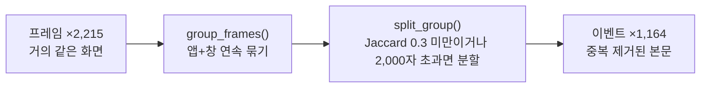

- **묶기** — 앱+창이 같은 *연속* 프레임만 한 덩어리로. 카톡 → 크롬 → 카톡이면 카톡 그룹이
  두 개다. 시간이 떨어진 걸 합치면 "언제"가 뭉개진다.
- **줄이기** — 그룹 전체에서 이미 본 줄은 버린다. 이벤트마다 `seen`을 비우면 사이드바 같은
  반복 줄이 이벤트마다 되살아난다.
- **나누기** — 창 제목이 안 바뀌는 앱(Claude, Code)에서는 서로 다른 작업이 한 그룹에 다
  들어온다. Jaccard 겹침이 임계 미만이거나 글자 수 상한을 넘으면 끊는다.

> 2026-08-02 실제 기록: **프레임 2,215개(7,482,811자) → 이벤트 1,164개(1,933,257자), 글자 −75%**

### 2. 색인 — 재실행해도 안전하게

[`index.py`](src/screenlog/index.py)는 id를 **내용 해시**(`app|window|start|text`)로 만든다.
재실행해도 중복이 안 쌓이고, 200개 단위 체크포인트라 중간에 죽어도 이어서 색인한다.

### 3. 라우팅 — 질문 하나에 LLM 호출 정확히 1회

[`router.py`](src/screenlog/router.py)의 `route()`가 JSON Schema 구조화 출력 한 번으로
아래를 전부 뽑는다.

| 필드 | 하는 일 |
|---|---|
| `app` / `site` | 검색을 좁히는 필터. **`enum`으로 강제** — 코퍼스에 없는 앱을 지어내는 걸 API 레벨에서 차단 |
| `hour_range` | 시각이 실제로 언급됐을 때만. 파싱 후 0~23 범위를 코드가 재검증 |
| `periods` | 기간을 **리스트**로. 하루짜리도 기간 1개로 통일해서 이후 단계의 이중 표현을 없앰 |
| `intent` | 검색 / 정리 / 비교 / 집계 |
| `search_query` | 후속 질문("최근 일주일로 넓혀줘")에 이전 대화의 주제를 합쳐 다시 쓴 검색 문장 |
| `count_by_site` | 집계를 앱 단위가 아니라 방문 도메인 단위로 |
| `compound` | 에이전트 폴백 여부. **전용 판별 호출을 없애고 이 필드 하나로 합쳐 질문당 LLM 1회를 줄였다** |


### 4. 답 생성 — 고정 경로 + 에이전트 폴백

복합 질문을 위해 ReAct 루프를 얹으면서, **이미 검증된 고정 경로를 망가뜨리지 않도록 설계했다.** ([`graph.py`](src/screenlog_langgraph/graph.py)·
[`agent.py`](src/screenlog_langgraph/agent.py))

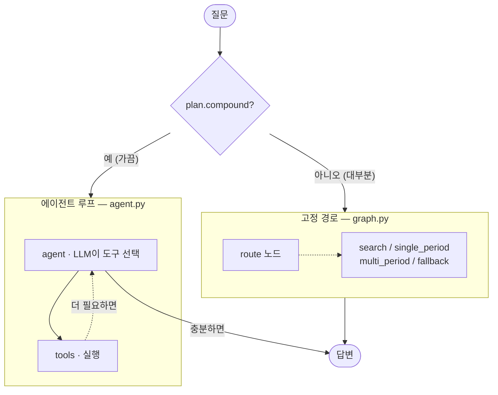

- **도구는 새 로직을 짜지 않는다.** 6개 도구(`search_events` / `count_events` /
  `summarize_days` / `compare_days` / `draft_handover_doc` / `draft_slack_message`) 전부
  기존 함수를 감싸서 구현했다.
- **가드레일**: 화이트리스트 6개 + `recursion_limit=8`. 한도를 넘기면 재시도 대신
  안내 문구로 끝낸다.
- **되돌릴 수 없는 행동은 도구가 아니다.** 슬랙 초안은 LLM이 만들지만 실제 전송은
  사용자가 버튼을 눌러야만 호출되는 별도 엔드포인트다. "승인된 것 같다"는 추론으로
  메시지가 나가면 안 되므로 자동 승인 감지는 **일부러 넣지 않았다.**
- **직전 답변 재사용은 LLM이 아니라 코드가 한다.** "그거 슬랙으로 보내자"는 재조회
  필터를 LLM이 다시 추론하다 무관한 내용을 만든 사고가 있어서, `InjectedState`로
  대화 기록을 도구에 넣었다.

### 같은 계약을 지키는 구현 셋

`api.py`가 환경변수 한 줄로 고르므로 A/B든 롤백이든 **코드 배포 없이** 끝난다.

| 구현 | 무엇을 새로 짰나 | 무엇을 그대로 썼나 |
|---|---|---|
| [`screenlog`](src/screenlog) (원본) | 전부 | — |
| [`screenlog_langchain`](src/screenlog_langchain) | LLM 호출만 (`with_structured_output`, LCEL `prompt \| llm \| parser`) | 데이터 계층 전부 |
| [`screenlog_langgraph`](src/screenlog_langgraph) | 오케스트레이션만 (StateGraph 분기, 커스텀 스트림, ReAct) | 프롬프트·검색·요약·캐시 전부 |

LangChain 버전에서 분기를 `RunnableBranch`로 안 옮긴 이유도 남겼다 — `route()` 한 번으로
확정되고 재판단이 없는 고정 흐름이라, 체인으로 감싼다고 더 명확해지지 않는다고 판단했다.

---

<a id="evaluation"></a>

## 📊 5. 평가

### 1. 라우팅 정확도 — 자기 검증의 편향까지 기록

| 단계 | app | hour | date |
|---|---|---|---|
| 3단계 (규칙 라우팅) | 15/15 | 15/15 | 15/15 |
| 4단계 (LLM 구조화 출력) | **18/18** | **18/18** | **18/18** |

3단계의 15/15에는 **편향이 있다** — 질문과 규칙을 같은 사람이 같은 코퍼스를 보고 만들었다.
그래서 사전에 없는 표현("화상회의 앱", "파일 관리자", "쉘")을 추가해 재검증했고, 그 과정에서
**LLM이 내용 질문에 없는 앱을 지어내는 버그**를 먼저 잡았다.
→ [`eval/routing/REPORT.md`](eval/routing/REPORT.md) · [`docs/routing-verification.md`](docs/routing-verification.md)

### 2. 검색 recall — 골든셋 25문항을 직접 라벨링

라벨링 도구([`label_retrieval.py`](eval/retrieval/label_retrieval.py))부터 자작했다.

| k | 5 | 6 | 7 | **8** | 9 | 10 | 20 |
|---|---|---|---|---|---|---|---|
| 평균 recall | 0.86 | 0.89 | 0.93 | **0.99** | 0.99 | 1.00 | 1.00 |

→ `RETRIEVE_K`를 10에서 8로 낮췄다. **recall 1%p를 내주고 프롬프트 근거를 20% 절감**한
트레이드오프다.

### 3. 검색 전략 7종 + 임베딩 3종을 비교하고 — 아무것도 바꾸지 않았다

"코퍼스가 커지면 하이브리드 검색이 필요하다"는 로드맵의 **가정을 검증**했다. 7개 방법을
[하나의 스크립트, 같은 채점 함수](eval/retrieval/final_search_comparison.py)로 통일해서 쟀다.

| 방법 | R@5 | P@5 | F1@5 | R@10 | F1@10 |
|---|---|---|---|---|---|
| **dense (프로덕션)** | **0.95** | 0.60 | **0.69** | **1.00** | 0.62 |
| bm25 | 0.63 | 0.34 | 0.42 | 0.71 | 0.34 |
| bm25 + 쿼리 확장 | 0.55 | 0.26 | 0.33 | 0.68 | 0.33 |
| 하이브리드 (dense+bm25, RRF) | 0.94 | 0.50 | 0.61 | 0.97 | 0.47 |
| 하이브리드 (확장 쿼리) | 0.89 | 0.50 | 0.60 | 0.97 | 0.49 |
| 리랭커 (cross-encoder) | 0.93 | **0.63** | **0.69** | 0.96 | **0.64** |
| HyDE | 0.68 | 0.35 | 0.44 | 0.80 | 0.39 |

**여기서 제일 중요한 건 리랭커다.** 평균 F1이 dense와 *정확히 같아서* "차이 없음"으로
넘어갈 뻔했는데, 문항별로 뜯어보니 동률이 아니었다.

| 질문 | dense | 리랭커 | 무슨 일이 |
|---|---|---|---|
| 정답이 하나뿐인 질문(r15) | 0.50 | **1.00** | 크게 개선 |
| 정답이 여러 페이지인 질문(r08) | 1.00 | **0.33** | 크게 악화 |

cross-encoder가 "가장 그럴듯한 하나"로 수렴해서, 정답이 갈리는 질문의 나머지를 순위 밖으로
밀어냈다. 평균이 같았던 건 개선분과 악화분이 **우연히 상쇄**된 결과였다 → 도입 보류.

임베딩 모델도 바꿔봤다. **bge-m3 F1@5 0.69 / multilingual-e5-large 0.50 / ko-sroberta 0.37** —
한국어 전용 모델이 다국어 모델에 못 미쳤다. 화면 캡처엔 영어 UI 문자열·고유명사가 섞여 있어
한국어 특화보다 다국어 커버리지가 더 중요한 것으로 보인다.

> 평균만 보고 채택했다면 특정 질문 유형이 조용히 망가졌을 것이다.
> 근거: [`eval/retrieval/RETRIEVAL_REPORT.md`](eval/retrieval/RETRIEVAL_REPORT.md)

### 4. 로컬 LLM의 결함을 파인튜닝과 아키텍처, 두 가지로 각각 고쳐서 비교했다

로컬 모델(Qwen2.5-7B)이 "하루 정리" 질문에서 하루의 대부분을 누락하는 문제를 실측했다
(8/3, 이벤트 3,190개 중 5개만 답함). 모델을 키워도(14B), 계열을 바꿔도(Llama) 안 고쳐졌다 —
**7~14B급 공통의 한계**라는 결론에 도달한 뒤, 두 방향으로 각각 해결해서 비교했다.

| 해법 | 방식 | 커버리지(원본 → 해법 적용, GOLD 대비) |
|---|---|---|
| LoRA 파인튜닝 | 68개 지식 증류 데이터로 모델 행동 자체를 교정 | 0.02~0.13 → **0.77~0.95** |
| 프롬프트 분할 | 시간대별 map-reduce, 모델은 그대로(학습 없음) | 0.02~0.13 → **0.81~1.00** |

분할 쪽은 블록별 결과를 단순히 이어붙이자 한 블록이 중국어로 답하는 오염이
하위 기능(비교·슬랙 초안)까지 전파됐고, "통째로 다시 정리(reduce)"로 고치려 하자 그 호출
자체가 긴 컨텍스트라 **recency bias를 재도입**해 커버리지가 도로 나빠졌다(1.00→0.19).
**오염된 블록만 골라 재시도**하는 방식으로 바꾸고 나서야 안정됐다.

LoRA 쪽은 "에러 없이 조용히 망가지는" 함정들이 존재했다 — 프롬프트 중앙값이 14,394토큰이라
흔한 기본값(`max_length=8192`)으로 잘랐으면 68개 중 46개에서 **학습 신호가 0**이 됐을 것이고,
토큰화 경계가 밀려 마스킹이 어긋난 것도 `assert`를 실패시켜서 찾았다. 16K 시퀀스 OOM은
끝부분 logits만 계산하는 `TailLossTrainer`를 직접 구현하고 기본 구현과 손실이 1e-6 오차 내
동일함을 검증한 뒤 반영했다.

> 근거: [`docs/local-llm-experiment-report.md`](docs/local-llm-experiment-report.md) ·
> [`eval/lora/`](eval/lora) · [`eval/summary_chunking/`](eval/summary_chunking)

---

<a id="decisions"></a>

## 🧭 6. 핵심 설계 결정

전체 기록은 **[설계 결정 문서](docs/engineering-decisions.md)**에 있다. 여기서는 둘만.

### LLM에게 시키면 안 되는 일을 가려냈다

| 맡겼더니 | 실제 결과 | 조치 |
|---|---|---|
| 사용 횟수 세기 | 실제 **340회를 "5회"** 로 답함 | `count_range()` — metadata를 코드가 직접 셈 |
| 요일 계산 | 7/27을 일요일이라고 답함 | 요일을 미리 계산해 프롬프트에 주입 |
| "어제"가 며칠인지 | 정확한 근거를 앞에 두고 "기록에 없다" | `today` 주입 + 재계산 금지 지시 |
| 앱 이름 추론 | 코퍼스에 없는 앱을 지어냄 | JSON Schema `enum`으로 **API 레벨에서 차단** |
| URL 인용 | 영상 제목을 붙여 가짜 링크 생성 | 이벤트에 실제 `url`을 저장해 근거에 같이 넣음 |

**LLM은 문장을 쓰고, 세고 거르는 일은 코드가 한다.**

### 실측으로 정한 값들

[`config.py`](src/screenlog/config.py)에 모여 있고, 전부 근거 주석이 붙어 있다.

| 값 | 설정 | 왜 이 값인가 |
|---|---|---|
| `RETRIEVE_K` | **8** | 골든셋 recall@8 = 0.99, @10 = 1.00. 1%p를 주고 프롬프트 근거 20% 절감 |
| `JACCARD_MIN` | **0.3** | 0.1/0.3/0.5 스윕에서 recall 차이 없음 → 기본값 유지 (표본 한계도 기록) |
| 검색 전략 | **dense 단독** | 6종 대안 전부 dense를 못 이김 |
| `CONTEXT_CHARS_PER_HIT` | **1500** | 이벤트 크기가 고르지 않다(중앙값 1,270자, 최대 36,870자) |
| `MAX_EVENTS_PER_DAY_SUMMARY` | **60** | 상한 없이 돌렸더니 하루 요약 프롬프트가 **1,005,356자** → 22,730자 |
| `MAX_PERIOD_SEARCH_K` | **50** | 기간 있는 검색은 k=8이면 관련 이벤트가 밀려서 통째로 누락 |
| `EMBED_BATCH_SIZE` | **4** | 기본값 32면 MPS OOM. 화면 텍스트 한 건이 길다 |
| `HISTORY_TURNS` | **2** | 5턴은 히스토리가 커져 할루시네이션이 늘었다 |
| `IDLE_GAP_SEC` | **120** | 이벤트 start/end만 쓰면 93%가 폭 0. 2분 초과 공백은 자리 비움으로 처리 |
| `AI_APPS` | `{Claude, Code}` | 재귀 오염 격리 (아래) |

프롬프트 상한을 걸 때 **앞자르기 대신 일정 간격 솎아내기**(`_thin_out()`)를 쓴 이유도
같은 성격이다 — 앞에서 자르면 하루의 오전만 남고 오후·저녁이 통째로 사라진다.

---

<a id="troubleshooting"></a>

## 🐛 7. 트러블슈팅 — 재귀 오염

23건 전체는 [`docs/troubleshooting-star.md`](docs/troubleshooting-star.md)에 STAR 형식으로 있다.

**문제** — 무관한 질문에 LLM이 **존재하지 않는 시각과 이벤트**를 근거로 인용했다. 검색은
정상이었고 프롬프트도 정상이었는데 답만 틀렸다.

**원인** — 근거를 하나씩 열어보니, 이 도구가 디버깅하며 터미널·에디터에 출력한 요약문이
**화면 캡처로 다시 색인**되어 검색 후보에 올라와 있었다. RAG가 자기 출력을 사실로
되읽고 있었던 것이다.

**해결** — 3단계로 막았다.

① AI 도구 앱(`Claude`, `Code`)을 검색 후보에서 제외

② 단 사용자가 그 앱을 명시적으로 물으면("코딩 몇 시간 했어?") 예외 — 정당한 질문까지
막으면 안 되므로

③ 그래도 걸린 근거는 API 응답에 `ai_app: true`로 표시해
**사용자가 한 번 더 의심할 수 있게** 했다.

> 자기 자신을 관측하는 시스템에서만 나오는 오염이라, 일반적인 RAG 체크리스트에는 없다.
> 완전 차단이 아니라 "격리 + 표시"를 택한 이유는, 원인 자체를 없애기는 어려웠기 때문이었다.

<details>
<summary><b>다른 5건 — 증상 / 진짜 원인 / 중요했던 것</b></summary>

<br>

| 증상 | 진짜 원인 | 해결 과정에서 중요했던 것 |
|---|---|---|
| 색인이 20분 → 예상 21시간 | **원인이 4겹**: Docker Desktop VM의 8GB 상시 예약 + Ctrl+Z로 방치된 좀비 프로세스 3개(모델 중복 로딩) + 배경 프로세스 + 물리 16GB 한계 | 가설을 하나씩 **수치로 반증**. "데이터가 늘었나"는 DB 쿼리로, "GPU 문제인가"는 격리 벤치마크로 지웠다 → **8배 개선** |
| 복합 질문 판별기가 항상 False | `except Exception: return False`가 **매 호출의 API 400을 조용히 삼키고** 있었다 | 폴백을 걷어내고 원시 예외를 직접 봤다. 고치니 이번엔 병렬 도구 호출로 chromadb 경쟁 상태가 드러나 `Lock`으로 해결 — **새 실행 경로는 기존 코드의 암묵적 전제를 깬다** |
| 멀티턴 도구 호출이 2번째 턴에서 400 | 게이트웨이가 Gemini 응답을 OpenAI 포맷으로 변환하며 `thought_signature`를 **누락** — 재전송할 값이 애초에 도달하지 않음 | `git stash`로 내 변경을 배제해 범위를 좁힌 뒤 원본 응답을 직접 열어봤다. **코드로 못 고치는 문제**로 판단하고 해당 경로만 모델 분리 |
| 색인할수록 메모리가 15GB까지 | MPS 캐싱 할당자가 길이가 들쭉날쭉한 배치(100~36,870자)마다 새 블록을 쌓기만 하고 반납 안 함 | 배치 크기(32→4)와 `torch.mps.empty_cache()`. 하드웨어 특성이 데이터 분포와 만나 생긴 문제 |
| 프로덕션 API가 인증 없이 인터넷에 노출 | "일단 띄우고 나중에 잠그자"가 그대로 남음 | Basic Auth를 붙이는 데 그치지 않고, **키가 없으면 서버가 기동 자체를 거부**하게 만들어 같은 실수의 여지를 없앴다 |

</details>

---

<a id="performance"></a>

## ⚡ 8. 성능

캐시 적중과 무관하게 항상 재현되는 숫자와, 사전 계산이 있어야만 나오는 숫자를 나눠서 측정했다.

| 항목 | 전 | 후 (캐시 무관, 항상 재현) | 캐시 적중 시 |
|---|---|---|---|
| "저번주 정리해줘" (7일) | ~20초 (순차) | **6.4초** (`asyncio.gather`) | 1.7~2.0초 |
| "저번주 vs 이번주" (14일) | ~45초 | **~10초** | — |
| 브라우저 제출 → 화면 완성(7일 정리) | ~20초 | ~7초대 | 4.6초 (첫 글자 2.0초) |

`asyncio.gather()`는 그 안에서는 병렬이지만, 밖에서 보면 **가장 느린 하루가 전체 응답
시간을 그대로 결정**하고 그때까지 사용자는 아무것도 못 본다. `asyncio.as_completed()`로
바꿔 먼저 끝난 날짜부터 스트리밍하도록 고쳤다.

| (같은 5일치, 캐시 우회) | 첫 토큰 | 총 완료 시간 |
|---|---|---|
| 전 (`gather`, 다 끝나야 반환) | 5.3~7.3초 | 5.3~7.3초 |
| 후 (`as_completed`, 먼저 끝난 것부터) | **1.4~1.9초** | 5.0~5.2초 |

**총 완료 시간은 거의 그대로다** — 하는 일의 총량은 안 줄었으니 당연하다. 대신
**체감 대기 시간이 약 4배 당겨졌다.** 단발 검색은 LLM을 한 번만 부르므로 개선폭이 훨씬
작다(첫 콘텐츠 1.86~2.04초 → 1.12~1.17초, ~40%) — **나눌 게 여러 개 있어야 스트리밍이
크게 이긴다**는 걸 숫자로 확인했다.

백엔드를 빠르게 만들자 **프론트 타이핑 애니메이션이 새 병목**이 됐다 — 4,600자 답이 즉시
도착해도 15ms마다 2글자씩 그리느라 30초가 걸렸다. 감쇠 계수를 실측(예상 90틱 → 실제 380틱)으로
보정해서 1.7초로 맞췄다.

**고쳐봤다가 되돌린 것도 남겼다.** "동기 `search()`가 이벤트 루프를 막는다"는 진단으로
`asyncio.to_thread()`를 적용했는데, 격리해서 재보니 임베딩+검색은 60~70ms고 LLM 생성은 ~2초라
**막고 있던 시간이 전체의 3%도 안 됐다.** 근거 없이 코드만 복잡해져서 되돌렸다.
→ [`docs/streaming-and-async.md`](docs/streaming-and-async.md) · [`docs/summary-cache.md`](docs/summary-cache.md)

---

<a id="web-api"></a>

## 🖥 9. 웹 서비스와 API

세 페이지 모두 의존성 없는 정적 HTML이고, 공유 디자인 토큰(`tokens.css`)만 같이 쓰도록 했다.

| 페이지 | 내용 |
|---|---|
| `/` (랜딩) | 서비스 소개 · 다운로드 유도. **인증 예외**(정확히 `/`만) |
| `/dashboard` (물어보기) | 채팅 · 라우팅 배지 · 근거 카드 · 활동 잔디 · 최근 기록 · 이전 대화 사이드바 |
| `/explore` (탐색) | 날짜별 앱 사용 · 하루 리본 타임라인 · **검색 후보 편중**(상위 앱이 후보의 몇 %인지) |

<table>
<tr>
<td width="50%">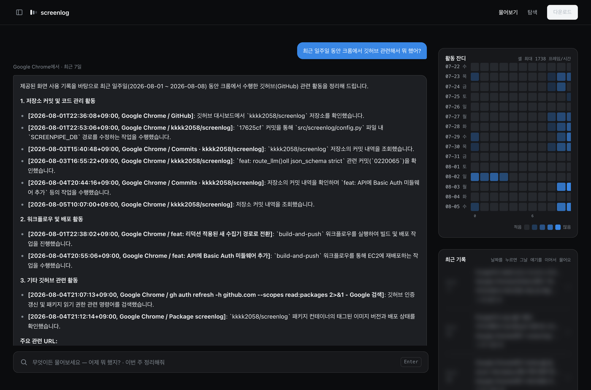</td>
<td width="50%">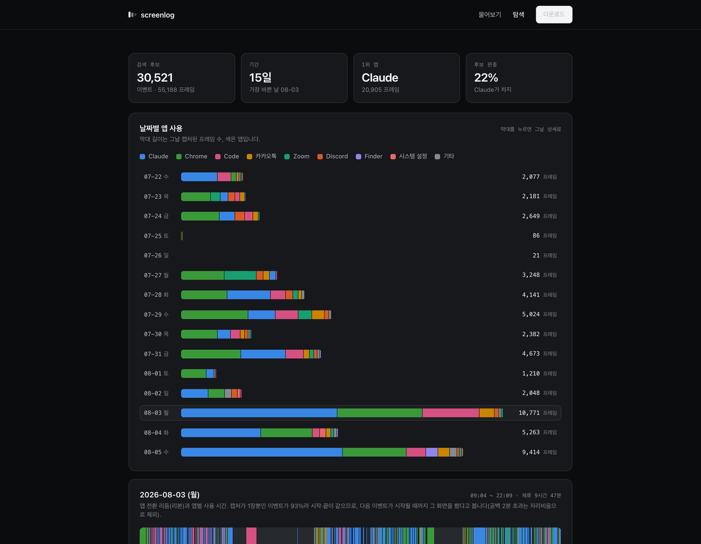</td>
</tr>
<tr>
<td><b>물어보기</b> — 질문창 옆에 활동 잔디(날짜×시각 격자)와 하루 요약 피드.
<sub>※ 요약 피드는 실제 대화 내용이라 이 이미지에서만 흐림 처리했다.</sub></td>
<td><b>탐색</b> — 본문을 한 글자도 안 읽고 metadata만으로 만든 집계. 맨 오른쪽 카드가
<b>"검색 후보 편중"</b>(상위 앱이 후보의 22%)으로, RAG 쏠림을 눈으로 보게 한 지표를 넣었다.</td>
</tr>
</table>

<div align="center">
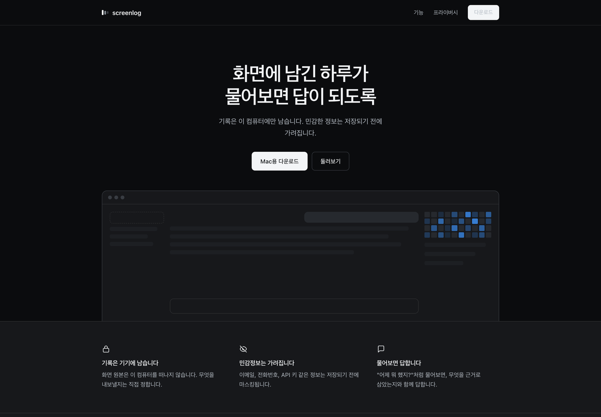
<br/><sub>랜딩(<code>/</code>) — 팀 배포용 <code>.dmg</code> 다운로드까지 여기서 이어진다. 인증 없이 접근 가능하다.</sub>
</div>

| 엔드포인트 | 설명 |
|---|---|
| `POST /api/ask` | 질문 → 답변 + 라우팅 계획 + 근거(본문은 200자 발췌) |
| `POST /api/ask/stream` | **SSE** — `conversation`/`plan`/`hits`/`token`/`tool_start`/`tool_done`/`done` |
| `GET /api/stats` · `/api/timeline/{date}` · `/api/digest` | 대시보드 집계 (본문 없이 숫자·앱 이름만) |
| `GET /api/conversations[/{id}]` | 대화 목록 / 재생 |
| `POST /api/slack/send` | 초안 전송 — 사용자가 버튼을 눌렀을 때만 |

`api.py`는 로직을 새로 짜지 않는다. `ask_auto()`를 얇게 감싸고, 오늘 날짜 다이제스트만
프로세스 메모리에 3분간 붙잡아 새로고침 병목을 없앤다(디스크 캐시에는 안 넣는다 —
오늘 기록은 계속 생기므로).

---

<a id="deployment"></a>

## 🚀 10. 배포

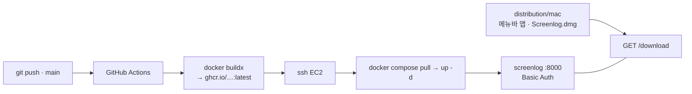

- **컨테이너**: `uv sync --frozen`을 2단 레이어(의존성 → 소스 → 정적 파일)로 나눠 캐시가
  안 깨지게. screenpipe sqlite는 `:ro`로, `chroma/`는 볼륨으로 붙인다.
- **무거운 일은 전부 로컬에서.** 임베딩은 Mac에서 끝내고 서버로는 결과물(벡터)만 올린다.
  원본 프레임 DB와 화면 캡처는 로컬을 떠나지 않는다.

### 수집기와 동기화 Mac 앱

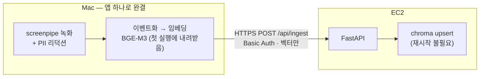

메뉴바 앱([`distribution/mac/menubar/app.py`](distribution/mac/menubar/app.py), rumps)은
녹화 시작/중지, 저장 용량·리덕션 진행률 표시, 서버 설정, 동기화를 담당한다.
저장소 클론도 `uv`도 SSH 키도 없이 `.dmg` 하나로 동작한다. 여기서의 판단들:

- **전송은 HTTP, 파일 복사가 아니다.** 예전엔 `chroma/`를 통째로 `rsync`한 뒤
  컨테이너를 재시작했는데, 그러면 (1) EC2 개인키를 앱에 넣어 배포해야 하고
  (2) 디렉토리를 덮어쓰니 팀원 두 명이 쓰면 나중 사람이 앞사람 데이터를 지우고
  (3) 재시작 동안 서비스가 멈춘다. id가 내용 해시라 `upsert`는 자연히 멱등하다.

- **임베딩 전에 서버에 먼저 물어본다.** 파이프라인에서 제일 비싼 단계가 임베딩이라,
  `/api/ingest/known`으로 이미 있는 id를 걸러야 두 번째 동기화부터 낭비가 없다
  (실측: 로컬 기록을 지워도 1.3초에 0건으로 끝난다).

- **서버가 벡터 차원을 검사한다.** 차원이 다른 벡터가 한 번 섞이면 검색이 깨지는데,
  그 시점엔 어느 게 잘못 들어갔는지 구분할 수 없다. 그래서 422로 미리 막는다.

- **모델(2.1GB)은 번들이 아니라 첫 실행에 받는다.** 넣으면 `.dmg`가 2.8GB가 되어
  애플 공증부터 재배포까지 전 과정이 무거워진다 — 내장 녹화기가 whisper를 첫 실행에
  받는 것과 같은 이유다. 안 쓰는 `onnx/`를 제외해 받는 양을 4.3GB → 2.1GB로 줄였다.

- **launchd가 아니라 GUI 앱이 녹화기를 직접 띄운다.** launchd로 조용히 띄우면 macOS 권한
  팝업에 사용자가 응답하기 전에 재시작을 반복하다 포기해버린다.
- **GUI 앱의 stdout은 `/dev/null`로 간다.** 그래서 파일 로그를 따로 남기고 "동기화 로그 보기"
  메뉴를 붙였다 — 백그라운드 작업이 조용히 실패했을 때 원인을 볼 수 있어야 한다.
- **고아 프로세스 정리**를 시작 전에 한다. 앱을 Quit해도 자식 녹화기가 살아남아 포트를 쥐고
  있으면, 새로 띄운 프로세스가 즉사하면서 UI만 "꺼짐"으로 잘못 표시된다.

배포는 `.dmg` 하나로 묶어 `/download`에서 받게 했다. **브라우저로 받아야** 격리(quarantine)
속성이 붙어서 Gatekeeper 경고까지 포함한 진짜 최초 설치 경험이 재현 가능하다.
→ [`docs/ec2-deployment-guide.md`](docs/ec2-deployment-guide.md) ·
[`docs/mac-app-and-download-page.md`](docs/mac-app-and-download-page.md) ·
[`docs/mac-app-self-contained.md`](docs/mac-app-self-contained.md) ·
[설치 안내](distribution/mac/README.md)

---

<a id="privacy"></a>

## 🔒 11. 개인정보

화면 기록에는 메신저 대화와 로그인 화면이 들어있다. 처음부터 제약으로 뒀다.

- 수집 단계에서 screenpipe의 **PII 리덕션**(secret/email/phone/person/address, 로컬 백엔드)을
  켜고, 리덕션된 DB를 `mode=ro`로만 연다
- 임베딩·요약을 로컬에서 끝내고 결과물(`chroma/`)만 보낸다 — **원본 프레임 DB는 로컬을
  떠나지 않는다**
- `chroma/`, `.env`, `eval/*/runs/`는 **커밋되지 않는다**
- API가 내보내는 근거는 본문 전체가 아니라 **200자 발췌**만 보이게 했다.
- 대시보드 집계는 **본문을 아예 안 읽는다** — 숫자와 앱 이름만
- 키가 없으면 서버가 기동을 거부하고, 비교는 `secrets.compare_digest`

---

<a id="limitations"></a>

## 🧱 12. 알려진 한계와 해결 방향

남은 것과 해결 방안을 같이 적었다.

| 한계 | 어느 계층의 문제인가 | 해결 방안 |
|---|---|---|
| Discord 캡처가 실제 메시지가 아닌 사이드바(서버·채널 목록) 위주로 찍힘 | 수집/OCR — 청킹·검색으로 못 고침 | 프레임에 이미 저장 중인 `text_source`(AX 트리 / OCR 폴백)를 활용해 AX일 때 채팅 영역 노드만 취하도록 수집을 좁힌다. 그 전에 **전역 빈발 라인 제거**를 `clean.py`에 얹어 비용 없이 효과를 먼저 잰다 |
| 창이 겹쳐 찍히면 본문이 섞임 (Gmail·Zoom에서 확인) | 수집 | 활성 창 기준으로만 텍스트를 취하도록 필터링. 먼저 **겹침 발생률 지표**를 만들어 빈도를 재는 게 순서 |
| Jira·캘린더 창의 청킹 민감도 미검증 | 평가 커버리지 | 이미 추출해둔 "청킹에 민감한 창 48개" 목록에서 골든셋 문항을 보강해 재측정 |
| 골든셋 r11 라벨 신뢰도 낮음 (창 제목이 무의미한 화면) | 라벨링 도구 | 창 제목이 아니라 **본문 임베딩 클러스터**로 후보를 묶어 보여주도록 도구 개선 |
| 비교형·집계형의 *정확도* 미검증 ("크래시 안 남"까지만 확인) | 평가 | 집계는 metadata에서 정답을 코드로 산출할 수 있다 → **자동 정답 라벨 생성**으로 완전 자동 채점 |
| `SCREENPIPE_DB`가 최근 며칠치만 보존 → 과거 재실험이 자주 막힘 | 데이터 보존 정책 | 재실험이 필요한 기간만 별도 백업하는 절차를 만든다 |
| 로컬 LLM recency bias 해법(LoRA/프롬프트 분할) 둘 다 검증만 하고 `summarize.py`엔 미반영 | 실사용 연결 | 둘 중 하나를 `USE_LOCAL_LLM` 경로에 실제로 연결 — LoRA는 GGUF만 교체, 분할은 `summarize_day()`에 map-reduce 추가 |

### 다음 마일스톤 — "물어봐야 답하는 도구"에서 "먼저 정리해주는 프로덕트"로

위가 갚아야 할 부채라면, 여기는 **이 도구가 어디로 가야 하는가**다. 셋 다 이미 만들어둔
조각을 잇는 일이라 새 기술이 아니라 **제품 판단**의 문제다.

| 방향 | 이미 있는 조각 | 다음 단계 |
|---|---|---|
| **주간 업무 리포트 자동 초안** | 하루 요약 캐시 + `summarize_range()` + 인수인계/슬랙 초안 양식 | 금요일 저녁에 그 주의 캐시를 모아 리포트 초안을 **먼저 만들어 두고** 알림만 준다. 사람은 고치고 승인만 — "이번 주 뭐 했지"를 매번 묻지 않아도 되게 |
| **묻기 전에 먼저 말해주기** | `/api/digest`(최근 n일 요약) + 활동 잔디·리본 타임라인 | 하루 마감 다이제스트, "어제와 다른 점"처럼 **변화를 감지해서 먼저 띄우는** 알림. |
| **팀에서 쓰되 데이터는 각자 로컬에** | `.dmg` 배포 + `/download` + Basic Auth + `chroma/`만 전송하는 동기화 | 계정별 인덱스 격리와 권한. **원본은 각자 기기에 두고 요약본만 공유**하는 경계를 유지하는 게 설계의 핵심. |

> 세 방향 모두 **"사용자가 질문을 떠올려야 한다"는 지금의 전제를 깨는 것**이 목표다.

---

<a id="docs-map"></a>

## 📚 13. 문서 지도

| 문서 | 내용 |
|---|---|
| [**설계 결정 기록**](docs/engineering-decisions.md) | 왜 그렇게 정했나 — 작업 원칙 4가지, 개발 단계별 통과 기준, 실측으로 정한 값들, 배포, API |
| [`docs/troubleshooting-star.md`](docs/troubleshooting-star.md) | **STAR 형식 23건** — 4겹으로 쌓인 성능 저하, 조용히 실패하는 폴백, 게이트웨이 필드 누락, 코드 리뷰로 발견한 레이스 등 |
| [`eval/retrieval/RETRIEVAL_REPORT.md`](eval/retrieval/RETRIEVAL_REPORT.md) | 골든셋 구축 · recall@k · 청킹 스윕 · 검색 전략 7종 · 임베딩 모델 3종 |
| [`eval/routing/REPORT.md`](eval/routing/REPORT.md) | 바닐라 → 메타 필터 → 라우팅 → 여러 날짜, 단계별 비교 |
| [`docs/routing-verification.md`](docs/routing-verification.md) | 라우팅 12케이스 수동 검증표 |
| [`docs/local-llm-experiment-report.md`](docs/local-llm-experiment-report.md) | 로컬 LLM 3종 비교 → recency bias 원인 분석 → LoRA·프롬프트 분할 두 해법 검증 (질문별 원문 답변 전부 포함) |
| [`docs/langgraph-architecture.md`](docs/langgraph-architecture.md) | 2단 그래프 구조 (컴파일된 그래프에서 뽑은 mermaid) + 노드별 state 표 |
| [`docs/streaming-and-async.md`](docs/streaming-and-async.md) | SSE·async 전환 — 어디서 이득이 나고 어디서 안 나는지, 되돌린 변경까지 |
| [`docs/summary-cache.md`](docs/summary-cache.md) | 하루 요약 캐시와 **일부러 우회하는 6가지 조건** |
| [`docs/ec2-deployment-guide.md`](docs/ec2-deployment-guide.md) | 배포 파이프라인 전 절차 + 겪은 문제 6건 |
| [`docs/mac-app-and-download-page.md`](docs/mac-app-and-download-page.md) | screenpipe 소스 빌드 · py2app 패키징 · Gatekeeper · 다운로드 페이지 |
| [`docs/mac-app-self-contained.md`](docs/mac-app-self-contained.md) | 앱 자립화 — HTTP 인제스트 전환 · 모델 첫 실행 다운로드 · 저장소/SSH 키 의존 제거 |

---

<a id="quick-start"></a>

## 🏁 14. 빠른 시작

<details>
<summary><b>설치 · 색인 · 실행 · 평가 — 명령어 펼치기</b></summary>

<br>

**요구사항** — Python 3.14 · [uv](https://docs.astral.sh/uv/) · macOS(임베딩 MPS 가속) ·
[screenpipe](https://github.com/mediar-ai/screenpipe)로 수집된 `db.sqlite`

```bash
uv sync && cp .env.example .env
```

`.env`에 최소한 이 셋을 채운다. **없으면 서버가 기동하지 않는다**(화면 기록을 다루는 API라
인증 없이 뜨는 것을 [`config.py`](src/screenlog/config.py)가 막는다).

```
OPENAI_API_KEY=...      # 또는 ANTHROPIC_API_KEY / USE_LOCAL_LLM=1
SCREENLOG_USER=...
SCREENLOG_PASSWORD=...
```

**색인** — 어떤 날짜가 있는지 보고, 정제 결과를 눈으로 확인한 뒤, 하루씩 넣는다.

```bash
uv run python -m screenlog.source              # 수집된 날짜 목록
```

```bash
uv run python -m screenlog.clean 2026-08-05    # 정제 결과 무작위 3건 확인
```

```bash
uv run python -m screenlog.index 2026-08-05    # 날짜 생략 시 미색인분 전부
```

```bash
uv run python -m screenlog.summarize           # 지난 날 하루 요약 캐시 채우기
```

**실행**

```bash
uv run python -m screenlog.ask                 # CLI — 답변 + 근거 목록
```

```bash
uv run uvicorn screenlog.api:app --reload      # http://localhost:8000
```

```bash
docker compose up --build                      # 컨테이너로
```

**평가**

```bash
uv run python eval/routing/run_eval.py --auto        # 실제 진입점으로 18문항
```

```bash
uv run python eval/retrieval/eval_retrieval.py       # 골든셋 recall@k
```

```bash
uv sync --extra bm25 && uv run python eval/retrieval/final_search_comparison.py
```

> LLM 백엔드 우선순위는 `USE_LOCAL_LLM` → `OPENAI_API_KEY` → `ANTHROPIC_API_KEY`.
> 로컬 LLM으로 켰다가 말썽이면 **환경변수 한 줄만 비우면** 코드 변경 없이 롤백된다.

</details>

<details>
<summary><b>프로젝트 구조</b></summary>

<br>

```
src/screenlog/              # 본체
├── config.py               # 실험하면서 바뀌는 값 전부 여기 (근거 주석 포함)
├── source.py               # 1. screenpipe sqlite → 프레임 (읽기 전용, UTC→KST)
├── clean.py                # 2. 프레임 → 이벤트 (묶기·줄이기·나누기, URL→도메인)
├── index.py                # 3. BGE-M3 임베딩 → chroma (체크포인트·백필·락)
├── router.py               # 3. route() — 질문 → app/site/hour/periods/intent/compound
├── ask.py                  # 4. search() + ask() + ask_auto() + 토큰 스트리밍
├── summarize.py            # 4. 정리/비교/집계 + 인수인계/슬랙 초안 + 캐시 프리빌드
├── summary_cache.py        #    하루 요약 캐시 (sqlite, model 키 포함)
├── chat_history.py         #    대화 기록 (sqlite, 제목은 첫 질문을 그대로 자름)
├── stats.py                #    대시보드 집계 — metadata만, 본문은 안 읽음
├── slack_client.py         #    chat.postMessage 하나만 감싼 저수준 호출
├── api.py                  # 6. FastAPI — SSE · Basic Auth · 정적 서빙
└── static/                 #    index(랜딩) · dashboard(물어보기) · explore(탐색) · tokens.css

src/screenlog_langgraph/    # 오케스트레이션만 LangGraph로
├── graph.py                #   route → search/single_period/multi_period/fallback
└── agent.py                #   compound면 ReAct 루프 (도구 6개, recursion_limit=8)

src/screenlog_langchain/    # LLM 호출만 LCEL로 (비교용) — chains/router/pipeline

eval/routing/               # 라우팅 평가 — questions.jsonl · run_eval.py · eval_routing.py · REPORT.md
eval/retrieval/             # 검색 평가 — 골든셋 25문항 · 라벨링 도구 · 청킹/k/전략/임베딩 스윕 · RETRIEVAL_REPORT.md
eval/summary_chunking/      # 시간대 분할 요약(map-reduce) 실험 4종 — 분할 / 하위영향 / reduce / 오염블록 재시도
eval/lora/                  # LoRA 학습 데이터 생성 · 양자화 모델 held-out 비교

docs/                       # 트러블슈팅(STAR) 23건 + 주제별 기록 8편
distribution/mac/           # 메뉴바 앱(rumps) · Screenlog.dmg · 다운로드 페이지 · 설치 안내
.github/workflows/          # deploy.yml — 빌드 → GHCR → SSH 재배포
Dockerfile, docker-compose*.yml, pyproject.toml, uv.lock
```

</details>
