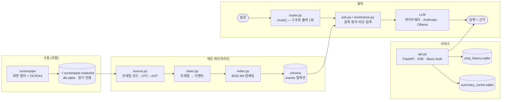
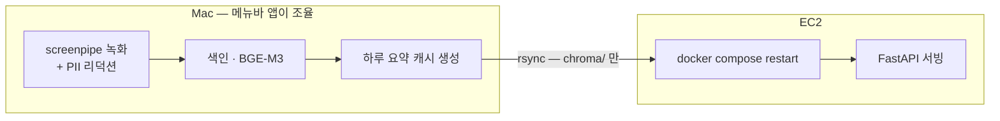

<div align="center">


# screenlog

**내 화면 기록에 물어보면 답이 되는 개인용 RAG.**

[](https://www.python.org/)
[](https://fastapi.tiangolo.com/)
[](https://www.trychroma.com/)
[](https://langchain-ai.github.io/langgraph/)
[](https://huggingface.co/BAAI/bge-m3)
[](https://github.com/features/actions)

<!-- ── 데모 GIF 자리 ────────────────────────────────────────────────
     아래 한 줄의 주석을 풀고 docs/demo.gif 를 추가한다.
     녹화 시나리오(5초): 질문 입력 → 라우팅 배지 표시 → 토큰 스트리밍 → 근거 카드 펼침
     
──────────────────────────────────────────────────────────────── -->

<table align="center">
<tr>
<td align="center" width="200"><h2>0.99</h2><b>검색 recall@8</b><br/><sub>골든셋 25문항 직접 라벨링</sub></td>
<td align="center" width="200"><h2>4.6초</h2><b>응답 시간 · 20초에서</b><br/><sub>병렬화 + 2단 캐시 + SSE</sub></td>
<td align="center" width="200"><h2>−97.7%</h2><b>프롬프트 길이</b><br/><sub>100만 자 → 2.3만 자</sub></td>
</tr>
</table>

</div>

---

[screenpipe](https://github.com/mediar-ai/screenpipe)가 몇 초마다 찍어둔 화면 기록을
읽어서, 한국어 질문에 근거와 함께 답한다. 수집·정제·임베딩·검색·요약·서빙·배포가 전부
이 저장소 안에 있고, **원본 데이터는 이 컴퓨터를 떠나지 않는다.**

| | |
|---|---|
| **기간 / 역할** | 2026.07.28 ~ 08.05 · 개인 프로젝트 1인 개발 (63 커밋) |
| **규모** | 백엔드 3,604줄 · 평가 스크립트 2,025줄 · 프론트 1,363줄 · 기술 문서 3,272줄 |
| **색인 데이터** | 이벤트 26,408개 / 14일치 / 앱 24종 / 벡터 DB 490MB |
| **결과물** | 웹 서비스(랜딩·질의·탐색) + 로컬 수집기·동기화 Mac 앱(.dmg) + EC2 자동 배포 |

---

## 무엇을 하는가

```
질문 > 이번 주에 카톡에서 약속 잡은 거 찾아봐
[라우팅: app=카카오톡 hour=- periods=[이번 주(5일)] intent=검색]

8월 3일 오후 9시 14분 카카오톡("밥도둑팟")에서 금요일 저녁 약속을 잡았습니다.

--- 근거 8개 ---
  [0.412] 2026-08-03T21:14:07  카카오톡 / 밥도둑팟
  [0.455] 2026-08-04T12:02:31  카카오톡 / 강현이
```

질문은 한 종류가 아니다. **같은 파이프라인으로 처리하면 전부 틀린다**는 걸 실측으로
확인하고, 답을 만드는 방식을 다섯 갈래로 나눴다.

| 유형 | 예시 | 답을 만드는 방식 |
|---|---|---|
| **검색** | "코드트리에서 뭐 풀었어?" | 벡터 검색 top-k → LLM이 근거로 답변 |
| **정리** | "어제 하루 정리해줘" | 날짜별 요약을 병렬 생성해서 이어붙임 |
| **비교** | "이번 주 언제가 제일 바빴어?" | 날짜별 요약 → 그 요약들을 다시 LLM으로 비교 |
| **집계** | "카톡 몇 번 켰어?" | **LLM을 안 거친다.** metadata를 직접 센다 |
| **복합** | "유튜브 몇 번 봤는지랑 뭐 봤는지 같이" | ReAct 에이전트가 위 도구들을 골라 조합 |

---

## 빠른 시작

**요구사항** — Python 3.14 · [uv](https://docs.astral.sh/uv/) · macOS(임베딩 MPS 가속) ·
[screenpipe](https://github.com/mediar-ai/screenpipe)로 수집된 `db.sqlite`

**1. 설치**

```bash
uv sync && cp .env.example .env
```

`.env`에 최소한 이 셋을 채운다. **없으면 서버가 기동하지 않는다** (화면 기록을 다루는
API라 인증 없이 뜨는 것을 코드가 막는다).

```
OPENAI_API_KEY=...      # 또는 ANTHROPIC_API_KEY / USE_LOCAL_LLM=1
SCREENLOG_USER=...
SCREENLOG_PASSWORD=...
```

**2. 색인** — 어떤 날짜가 있는지 보고, 정제 결과를 눈으로 확인한 뒤, 하루씩 넣는다.

```bash
uv run python -m screenlog.source              # 수집된 날짜 목록
```

```bash
uv run python -m screenlog.clean 2026-08-05    # 정제 결과 무작위 3건 확인
```

```bash
uv run python -m screenlog.index 2026-08-05    # 날짜 생략 시 미색인분 전부
```

**3. 실행**

```bash
uv run python -m screenlog.ask                 # CLI — 답변 + 근거 목록
```

```bash
uv run uvicorn screenlog.api:app --reload      # http://localhost:8000
```

```bash
docker compose up --build                      # 컨테이너로
```

**4. 평가**

```bash
uv run python eval/routing/run_eval.py --auto          # 실제 진입점으로 18문항
```

```bash
uv run python eval/retrieval/eval_retrieval.py           # recall@k
```

> 검색 전략 7종 비교(`eval/retrieval/final_search_comparison.py`)는 `uv sync --extra bm25`가 필요하다.
> LLM 백엔드 우선순위는 `USE_LOCAL_LLM` → `OPENAI_API_KEY` → `ANTHROPIC_API_KEY`이고,
> 로컬로 켰다가 말썽이면 **줄 하나만 비우면** 코드 변경 없이 롤백된다.

---

## 아키텍처



### 기술 스택과 선택 이유

| 영역 | 선택 | 왜 |
|---|---|---|
| 임베딩 | **BAAI/bge-m3** (sentence-transformers, 로컬) | 한국어 화면 텍스트 대응 + 원본이 컴퓨터를 안 떠나야 함 |
| 벡터 DB | **ChromaDB** PersistentClient (cosine) | app/hour/date `where` 필터가 필수. 임베디드라 개인용에 운영 부담 0 |
| LLM | 게이트웨이 · Anthropic · Ollama **3중 스위치** | 환경변수 한 줄로 전환/롤백. 벤더 장애·크레딧 소진 대비 |
| 에이전트 모델 | 멀티턴만 별도 모델로 **분리** | 게이트웨이가 Gemini의 `thought_signature`를 누락시켜 2턴부터 400 에러 |
| 서버 | **FastAPI** + uvicorn + SSE | 날짜별 요약을 `asyncio.gather`로 겹쳐 처리 + 토큰 단위 스트리밍 |
| 오케스트레이션 | **LangGraph** StateGraph + 커스텀 ReAct | 고정 분기와 폴백 루프를 한 상태 기계로. 스트리밍 이벤트를 노드에서 직접 방출 |
| 저장 | sqlite ×3 (원본 `ro` / 대화 / 요약 캐시) | 단일 노드 개인 도구에 별도 DB 서버는 과함 |
| 배포 | Docker + GitHub Actions + GHCR + EC2 | `git push` 한 번으로 이미지 빌드 → SSH 재배포 |

> 같은 계약을 지키는 구현이 셋(`screenlog` / `_langchain` / `_langgraph`) 있고,
> `api.py`가 환경변수 한 줄로 고른다 — A/B든 롤백이든 코드 배포 없이 끝난다.

### 수집기와 동기화 — 무거운 일은 전부 로컬에서

임베딩과 요약은 **내 Mac에서** 끝내고, 서버로는 결과물만 보낸다. 원본 프레임 DB(캡처
단위 기록)는 로컬을 떠나지 않는다.



메뉴바 앱([`distribution/mac`](distribution/mac))은 녹화 시작/중지, 저장 용량·리덕션
진행률 표시, 그리고 위 4단계 동기화를 담당한다. 여기서의 판단들:

- **단계마다 실패 정책이 다르다.** 요약 생성이 실패하면 **무시하고 진행**한다 — 요약이
  없으면 서버가 즉석 계산으로 자동 대체되므로 색인 결과까지 버릴 이유가 없다. 반면
  색인·전송 실패는 중단한다.
- **전송 후 컨테이너를 재시작한다.** 서버는 chroma 클라이언트를 프로세스 시작 시점에
  한 번 열어 캐싱하므로, `rsync`로 파일만 바꾸면 **옛 인덱스로 계속 답한다**(실측).
- **launchd가 아니라 GUI 앱이 녹화기를 직접 띄운다.** launchd로 조용히 띄우면 macOS
  권한 팝업에 사용자가 응답하기 전에 재시작을 반복하다 포기해버린다.
- **GUI 앱의 stdout은 `/dev/null`로 간다.** 그래서 파일 로그를 따로 남기고 "동기화 로그
  보기" 메뉴를 붙였다 — 백그라운드 작업이 조용히 실패했을 때 원인을 볼 수 있어야 한다.

배포는 `.dmg` 하나로 묶어 `/download`에서 받게 했다. **브라우저로 받아야** 격리
(quarantine) 속성이 붙어서 Gatekeeper 경고까지 포함한 진짜 최초 설치 경험이 재현된다.
겪은 문제 5건: [`mac-app-and-download-page.md`](docs/mac-app-and-download-page.md)

---

## 핵심 설계 결정

전체 기록은 **[설계 결정 문서](docs/engineering-decisions.md)**에 있다. 여기서는 셋만.

### 1. 검색 전략 7종을 비교하고 — 아무것도 바꾸지 않았다

"코퍼스가 커지면 하이브리드 검색이 필요하다"는 로드맵의 가정을 검증했다. 결과는 dense
단독이 최고였고(F1@5 0.69), BM25·하이브리드·HyDE는 명백히 나빴다.

**문제는 리랭커였다.** 평균 F1이 dense와 *정확히 같아서* "차이 없음"으로 넘어갈 뻔했는데,
문항별로 뜯어보니 동률이 아니었다.

| 질문 | dense | 리랭커 | 무슨 일이 |
|---|---|---|---|
| 정답이 하나뿐인 질문(r15) | 0.50 | **1.00** | 크게 개선 |
| 정답이 여러 페이지인 질문(r08) | 1.00 | **0.33** | 크게 악화 |

cross-encoder가 "가장 그럴듯한 하나"로 수렴해서, 정답이 갈리는 질문의 나머지를 순위 밖으로
밀어냈다. 평균이 같았던 건 개선분과 악화분이 **우연히 상쇄**된 결과였다 → 전면 도입 보류.

> 평균만 보고 채택했다면 특정 질문 유형이 조용히 망가졌을 것이다.
> 근거: [`eval/retrieval/RETRIEVAL_REPORT.md`](eval/retrieval/RETRIEVAL_REPORT.md)

### 2. LLM에게 시키면 안 되는 일을 가려냈다

| 맡겼더니 | 실제 결과 | 조치 |
|---|---|---|
| 사용 횟수 세기 | 실제 **340회를 "5회"** 로 답함 | `count_range()` — metadata를 코드가 직접 셈 |
| 요일 계산 | 7/27을 일요일이라고 답함 | 요일을 미리 계산해 프롬프트에 박아넣음 |
| "어제"가 며칠인지 | 정확한 근거를 앞에 두고 "기록에 없다" | `today` 주입 + 재계산 금지 지시 |
| 앱 이름 추론 | 코퍼스에 없는 앱을 지어냄 | JSON Schema `enum`으로 **API 레벨에서 차단** |

**LLM은 문장을 쓰고, 세고 거르는 일은 코드가 한다.** 이 경계를 도구 내부에 박아두니,
에이전트가 어떤 순서로 도구를 부르든 집계 정확도가 깨지지 않는다.

### 3. 평가 기준을 먼저 만들고 파라미터를 정했다

검색이 정답을 가져오는지 잴 방법이 없어서 **골든셋 25문항을 직접 라벨링**했다(도구부터
자작). recall@k를 재보니 k=8에서 무릎이 꺾였다.

| k | 5 | 6 | 7 | **8** | 9 | 10 |
|---|---|---|---|---|---|---|
| 평균 recall | 0.86 | 0.89 | 0.93 | **0.99** | 0.99 | 1.00 |

→ `RETRIEVE_K`를 10에서 8로 낮췄다. **recall 1%p를 내주고 프롬프트 근거를 20% 절감**한
트레이드오프다. 라벨링 도중 저지른 실수 두 건도 리포트에 그대로 남겼다 — 실수를 지우면
그 지표가 왜 그 값인지 나중에 복원할 수 없다.

### 4. 로컬 LLM의 결함을 파인튜닝과 아키텍처, 두 가지로 각각 고쳐서 비교했다

로컬 모델(Qwen2.5-7B)이 "하루 정리" 질문에서 하루의 대부분을 누락하는 문제를
실측했다(8/3, 이벤트 3,190개 중 5개만 답함). 모델을 키워도(14B), 계열을
바꿔도(Llama) 안 고쳐졌다 — 그래서 서로 다른 층위의 해법 둘을 각각 검증했다.

| 해법 | 방식 | 커버리지(원본 → 해법 적용, GOLD 대비) |
|---|---|---|
| LoRA 파인튜닝 | 68개 지식 증류 데이터로 모델 행동 자체를 교정 | 0.02~0.13 → 0.77~0.95 |
| 프롬프트 분할 | 시간대별 map-reduce, 모델은 그대로(학습 없음) | 0.02~0.13 → 0.81~1.00 |

둘 다 통했지만 분할 쪽은 가는 길이 순탄치 않았다. 블록별 결과를 단순히
이어붙이자 한 블록이 중국어로 답하는 오염이 하위 기능(비교·슬랙 초안)까지
전파됐고, "통째로 다시 정리(reduce)"로 고치려 하자 그 호출 자체가 긴
컨텍스트라 recency bias를 재도입해 커버리지가 도로 나빠졌다(1.00→0.19).
**오염된 블록만 골라 재시도**하는 방식으로 바꾸고 나서야 안정됐다.

> 근거: [`docs/local-llm-experiment-report.md`](docs/local-llm-experiment-report.md)

---

## 트러블슈팅 — 재귀 오염

23건 전체는 [`docs/troubleshooting-star.md`](docs/troubleshooting-star.md)에 STAR 형식으로
있다. 가장 이 프로젝트다운 한 건만 옮긴다.

**문제** — 무관한 질문에 LLM이 **존재하지 않는 시각과 이벤트**를 근거로 인용했다. 검색은
정상이었고 프롬프트도 정상이었는데 답만 틀렸다.

**원인** — 근거를 하나씩 열어보니, 이 도구가 디버깅하며 터미널·에디터에 출력한 요약문이
**화면 캡처로 다시 색인**되어 검색 후보에 올라와 있었다. RAG가 자기 출력을 사실로
되읽고 있었던 것이다.

**해결** — 세 겹으로 막았다.
① AI 도구 앱(`Claude`, `Code`)을 검색 후보에서 제외
② 단 사용자가 그 앱을 명시적으로 물으면("코딩 몇 시간 했어?") 예외 — 정당한 질문까지
막으면 안 되므로
③ 그래도 걸린 근거는 API 응답에 `ai_app: true`로 표시해 **사용자가 한 번 더 의심할 수
있게** 했다

> 자기 자신을 관측하는 시스템에서만 나오는 오염이라, 일반적인 RAG 체크리스트에는 없다.
> 완전 차단이 아니라 "격리 + 표시"를 택한 이유는, 원인을 없앨 수 없는 문제이기 때문이다.

---

## 알려진 한계와 해결 방향

해결한 것만 쓰면 리포트가 아니라 광고가 된다. 남은 것과 다음 수를 같이 적는다.

| 한계 | 어느 계층의 문제인가 | 다음 수 |
|---|---|---|
| Discord 캡처가 실제 메시지가 아닌 사이드바(서버·채널 목록) 위주로 찍힘 | 수집/OCR — 청킹·검색으로 못 고침 | 프레임에 이미 저장 중인 `text_source`(AX 트리 / OCR 폴백)를 활용해 AX일 때 채팅 영역 노드만 취하도록 수집을 좁힌다. 그 전에 **전역 빈발 라인 제거**를 `clean.py`에 얹어 비용 없이 효과를 먼저 잰다 |
| 창이 겹쳐 찍히면 본문이 섞임 (Gmail·Zoom에서 확인) | 수집 | 활성 창 기준으로만 텍스트를 취하도록 필터링. 먼저 **겹침 발생률 지표**를 만들어 빈도를 재는 게 순서 |
| 리덕션 DB가 최근 5일만 보존 → 과거 데이터 재실험 불가 | 데이터 보존 정책 | 평가에 쓰는 날짜만 별도 sqlite로 떠두는 아카이브 스크립트를 `eval/`에 추가해 **재현성**을 확보 |
| Jira·캘린더 창의 청킹 민감도 미검증 | 평가 커버리지 | 이미 추출해둔 "청킹에 민감한 창 48개" 목록에서 골든셋 문항을 보강해 재측정 |
| 골든셋 r11 라벨 신뢰도 낮음 (창 제목이 무의미한 화면) | 라벨링 도구 | 창 제목이 아니라 **본문 임베딩 클러스터**로 후보를 묶어 보여주도록 도구 개선 |
| 비교형·집계형의 *정확도* 미검증 ("크래시 안 남"까지만 확인) | 평가 | 집계는 metadata에서 정답을 코드로 산출할 수 있다 → **자동 정답 라벨 생성**으로 완전 자동 채점 |
| 로컬 LLM recency bias 해법(LoRA/프롬프트 분할) 둘 다 검증만 하고 `summarize.py`엔 미반영 | 실사용 연결 | 둘 중 하나를 `USE_LOCAL_LLM` 경로에 실제로 연결 — LoRA는 GGUF만 교체, 분할은 `summarize_day()`에 map-reduce 추가 |

---

## 문서

이 프로젝트의 결과물 절반은 코드가 아니라 기록이다.

| 문서 | 내용 |
|---|---|
| [**설계 결정 기록**](docs/engineering-decisions.md) | 왜 그렇게 정했나 — 작업 원칙, 실측으로 정한 값 9개, 평가 전문, 배포, API |
| [`docs/troubleshooting-star.md`](docs/troubleshooting-star.md) | **STAR 형식 23건** — 4겹으로 쌓인 성능 저하, 조용히 실패하는 폴백, 게이트웨이 필드 누락 등 |
| [`eval/retrieval/RETRIEVAL_REPORT.md`](eval/retrieval/RETRIEVAL_REPORT.md) | 골든셋 구축 · recall@k · 청킹 스윕 · 검색 전략 7종 비교 |
| [`eval/routing/REPORT.md`](eval/routing/REPORT.md) | 바닐라 → 필터 → 라우팅 → 여러 날짜, 단계별 비교 |
| [`docs/local-llm-experiment-report.md`](docs/local-llm-experiment-report.md) | 로컬 LLM 3종 비교 → recency bias 원인 분석 → LoRA 파인튜닝·프롬프트 분할 두 해법 검증 |
| [`docs/langgraph-architecture.md`](docs/langgraph-architecture.md) | 2단 그래프 구조 (컴파일된 그래프에서 뽑은 mermaid) |
| [`docs/streaming-and-async.md`](docs/streaming-and-async.md) · [`summary-cache.md`](docs/summary-cache.md) | SSE·async 전환과 요약 캐시 — 어디서 이득이 나고 어디서 안 나는지 |
| [`docs/ec2-deployment-guide.md`](docs/ec2-deployment-guide.md) · [`mac-app-and-download-page.md`](docs/mac-app-and-download-page.md) | 배포 파이프라인과 Mac 앱 패키징 |

<details>
<summary><b>프로젝트 구조</b></summary>

<br>

```
src/screenlog/              # 본체
├── config.py               # 실험하면서 바뀌는 값 전부 여기 (근거 주석 포함)
├── source.py               # 1. screenpipe sqlite → 프레임 (읽기 전용, UTC→KST)
├── clean.py                # 2. 프레임 → 이벤트 (묶기·줄이기·나누기)
├── index.py                # 3. BGE-M3 임베딩 → chroma
├── router.py               # 3. route() — 질문 → app/site/hour/periods/intent/compound
├── ask.py                  # 4. search() + ask() + ask_auto() + 스트리밍
├── summarize.py            # 4. 정리/비교/집계 + 인수인계/슬랙 초안
├── summary_cache.py        #    하루 요약 캐시 (sqlite)
├── chat_history.py         #    대화 기록 (sqlite)
├── stats.py                #    대시보드 집계 — metadata만, 본문은 안 읽음
├── api.py                  # 6. FastAPI — SSE · Basic Auth · 정적 서빙
└── static/                 #    랜딩 · 물어보기 · 탐색

src/screenlog_langgraph/    # 오케스트레이션만 LangGraph로 (graph.py + agent.py)
src/screenlog_langchain/    # LLM 호출만 LCEL로 (비교용)

eval/routing/               # 라우팅 평가 — questions.jsonl · REPORT.md
eval/retrieval/             # 검색 평가 — 골든셋 · 청킹/전략 스윕 · RETRIEVAL_REPORT.md
eval/summary_chunking/      # 시간대 분할 요약(map-reduce) 실험
eval/lora/                  # LoRA 파인튜닝 실험
docs/                       # 트러블슈팅(STAR) 23건 + 주제별 기록 8편
distribution/mac/           # 메뉴바 앱 · dmg · 설치 안내
```

</details>

---

## 개인정보

화면 기록에는 메신저 대화와 로그인 화면이 들어있다. 처음부터 제약으로 뒀다.

- 수집 단계에서 **리덕션된 DB**를 읽고, 원본은 `mode=ro`로만 연다
- 임베딩·요약을 로컬에서 끝내고 결과물(`chroma/`)만 보낸다 — **원본 프레임 DB는 로컬을
  떠나지 않는다**
- `chroma/`, `.env`, `eval/*/runs/`는 **커밋되지 않는다**
- API가 내보내는 근거는 본문 전체가 아니라 **200자 발췌**뿐이다
- 대시보드 집계는 **본문을 아예 안 읽는다** — 숫자와 앱 이름만
- 키가 없으면 서버가 기동을 거부하고, 비교는 `secrets.compare_digest`(타이밍 공격 방어)
