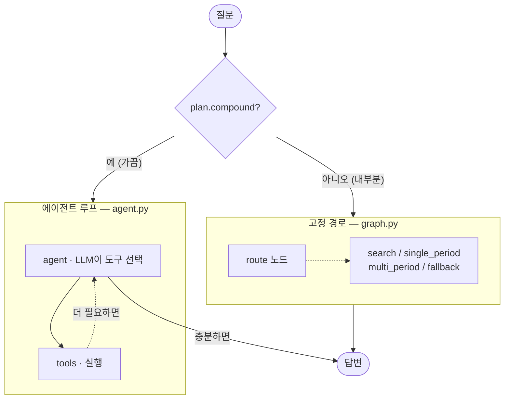
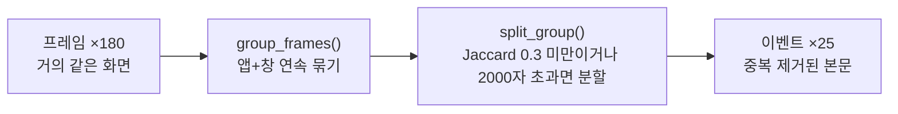
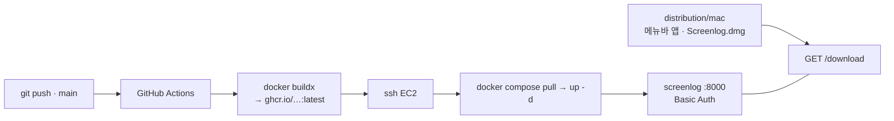

# 설계 결정 기록

[README](../README.md)가 "무엇을 만들었나"라면 이 문서는 **"왜 그렇게 정했나"**다.
숫자와 근거는 [`eval/REPORT.md`](../eval/routing/REPORT.md) ·
[`eval/RETRIEVAL_REPORT.md`](../eval/retrieval/RETRIEVAL_REPORT.md)에, 장애 대응 과정은
[`troubleshooting-star.md`](troubleshooting-star.md)에 있다.

---

## 작업 원칙 네 가지

**1. 바닐라부터 시작한다.** 교과서 RAG(프레임 텍스트 → 청킹 → 임베딩 → top-k → LLM)가
이 데이터에서 *얼마나 안 되는지*를 먼저 숫자로 봤다. 베이스라인 없이 개선하면
"좋아진 것 같다"만 남고 "얼마나 좋아졌다"는 못 말한다. 0단계 결과는 지우지 않았다.

**2. 숫자를 남긴다.** 터미널에만 뜬 숫자는 다음 날이면 사라진다. 모든 실험은 원문
답변까지 파일로 저장되고, 결론은 리포트로 남는다.

**3. 원본을 복사하지 않는다.** screenpipe의 sqlite를 `mode=ro`로 직접 읽는다. 덤프
사본을 만들면 원본이 자란 뒤 사본이 뒤처져서, 결과가 어느 시점 데이터인지 알 수 없게 된다.

**4. "실험해서 안 바꾸기로 했다"도 결론이다.** 검색 전략 5종을 붙여봤지만 dense 단독을
못 이겨서 그대로 뒀다. 바꾸지 않기로 한 이유까지 남겼다.

### 개발 순서 — 각 단계는 통과 기준을 넘기 전에 다음으로 안 갔다

| 단계 | 무엇 | 통과 기준 | 상태 |
|---|---|---|---|
| 0. 바닐라 | sqlite → 프레임 그대로 색인 → 검색 → LLM | 질문 하나에 답이 나온다 | ✅ |
| 1. 정제 | 프레임 → 이벤트 (연속 중복 접기) | 무작위 20건에서 "아 이때 이거 했지"가 읽힌다 | ✅ |
| 2. 메타 필터 | app/hour/date를 metadata로 | `where`로 앱 지정 검색이 된다 | ✅ |
| 3. 라우팅 | 질문에서 필터 뽑기 | 앱 지정 질문 정확도가 0단계보다 오른다 | ✅ 18/18 |
| 4. 조회 | "오늘 뭐 했지" = 검색이 아니라 조회 | 하루 요약에 여러 앱이 등장한다 | ✅ |
| 5. 하이브리드 | 키워드 + 벡터, 순위 융합 | 고유명사 질문에서 벡터 단독보다 낫다 | ⛔ 실험 후 기각 |
| 6. 서비스 | 웹 UI · 스트리밍 · 배포 | — | ✅ |
| 7. 에이전트 | 4갈래로 못 푸는 복합 질문 | 고정 경로를 안 깨면서 폴백된다 | ✅ |

기준을 못 넘으면 다음 기능을 얹어도 그 효과를 잴 수 없기 때문이다.

---

## 1. 평가 없이는 개선을 말하지 않는다

검색이 정말 정답을 가져오는지 잴 방법이 없어서, **"질문 → 정답 이벤트" 골든셋 25문항을
직접 만들었다.** 라벨링 도구([`label_retrieval.py`](../eval/retrieval/label_retrieval.py))부터 짜야
했고, 그 도구를 만드는 과정에서 프로덕션 코드의 필터 로직이 빠진 것도 발견했다.

| k | 5 | 6 | 7 | **8** | 9 | 10 | 20 |
|---|---|---|---|---|---|---|---|
| 평균 recall | 0.86 | 0.89 | 0.93 | **0.99** | 0.99 | 1.00 | 1.00 |

k=8에서 무릎이 꺾인다 → **`RETRIEVE_K`를 10에서 8로 낮췄다.** recall 손실 1%p를 주고
프롬프트에 들어가는 근거를 20% 줄인 트레이드오프다.

라벨링 도중 저지른 실수 두 건(중복 캡처를 전부 정답으로 셈 → 그 수정을 예외 없이
적용해서 진짜 정답 8개를 날림)도 리포트에 그대로 남겼다. 실수를 지우면 그 지표가 왜
그 값인지 다음 사람이(그리고 미래의 내가) 복원할 수 없다.

---

## 2. 다섯 번 실험하고 전부 기각했다

"코퍼스가 커지면 하이브리드 검색이 필요하다"는 로드맵의 **가정을 검증**했다. 7개 방법을
같은 스크립트·같은 채점 함수로 통일해서 쟀다.

| 방법 | R@5 | P@5 | F1@5 | R@10 | F1@10 |
|---|---|---|---|---|---|
| **dense (프로덕션)** | **0.95** | 0.60 | **0.69** | **1.00** | 0.62 |
| bm25 | 0.63 | 0.34 | 0.42 | 0.71 | 0.34 |
| bm25 + 쿼리 확장 | 0.55 | 0.26 | 0.33 | 0.68 | 0.33 |
| 하이브리드 (dense+bm25, RRF) | 0.94 | 0.50 | 0.61 | 0.97 | 0.47 |
| 하이브리드 (확장 쿼리) | 0.89 | 0.50 | 0.60 | 0.97 | 0.49 |
| 리랭커 (cross-encoder) | 0.93 | **0.63** | **0.69** | 0.96 | **0.64** |
| HyDE | 0.68 | 0.35 | 0.44 | 0.80 | 0.39 |

**여기서 제일 중요한 건 리랭커다.** 평균 F1이 dense와 정확히 같아서 "차이 없음"으로
넘어갈 뻔했는데, 문항별로 뜯어보니 동률이 아니었다 — 정답이 하나뿐인 질문은 크게
개선하고(r15: 0.50→1.00), **정답이 여러 페이지로 갈리는 질문은 크게 악화**시켰다
(r08: 1.00→0.33). cross-encoder가 "가장 그럴듯한 하나"로 수렴하기 때문이고, 평균이
같았던 건 개선분과 악화분이 우연히 상쇄된 결과였다. → **전면 도입 보류.**

> 평균만 보고 채택했다면 특정 질문 유형이 조용히 망가졌을 것이다.

BM25가 진 이유도 확인했다 — "커밋 컨벤션"을 물었는데 실제 화면엔 "Commit 타입"으로
찍혀 있어 형태소 토큰이 아예 안 겹쳤다. dense는 의미 유사도로 커버하지만 BM25는
토큰이 안 맞으면 못 찾는다. screenpipe(FTS5)처럼 복합어 분리 + 접두어 매칭을 흉내내
봤더니 **오히려 더 나빠졌다**(R@5 0.63→0.55) — "이", "그" 같은 짧은 형태소가 어휘
수백 개와 접두어가 겹쳐 노이즈만 늘었다.

---

## 3. LLM에게 시키면 안 되는 일을 가려냈다

실측으로 하나씩 확인해서, LLM에서 코드로 옮긴 것들:

| 맡겼더니 | 실제 결과 | 조치 |
|---|---|---|
| 사용 횟수 세기 | 실제 **340회를 "5회"** 로 답함 | `count_range()` — metadata를 코드가 직접 셈 |
| 요일 계산 | 7/27을 일요일이라고 답함 | 프롬프트에 요일을 미리 계산해 박아넣음 |
| "어제"가 며칠인지 | 정확한 근거를 눈앞에 두고 "기록에 없다" | `today`를 프롬프트에 주입 + 재계산 금지 지시 |
| 앱 이름 추론 | 코퍼스에 없는 앱을 지어냄 | JSON Schema `enum`으로 **API 레벨에서 차단** |

LLM은 문장을 쓰고, 세고 거르는 일은 코드가 한다. 이 경계를 지키니 에이전트가 도구를
어떤 순서로 부르든 집계 정확도가 깨지지 않는다.

---

## 4. 재귀 오염 — RAG가 자기 출력을 사실로 되읽는 문제

무관한 질문에 LLM이 **존재하지 않는 시각과 이벤트**를 근거로 인용하는 사고가 났다.
추적해보니, 이 도구가 디버깅하며 터미널·에디터에 출력한 요약문이 **화면 캡처로 다시
색인**되어 검색 후보에 올라온 것이었다.

조치는 세 겹이다 — ① AI 도구 앱(`Claude`, `Code`)을 검색 후보에서 제외 ② 단 사용자가
그 앱을 명시적으로 물으면("코딩 몇 시간 했어?") 예외 ③ 그래도 걸린 근거는 API 응답에
`ai_app: true`로 표시해서 **사용자가 한 번 더 의심할 수 있게** 했다.

> 자기 자신을 관측하는 시스템에서만 나오는 종류의 오염이라, 일반적인 RAG 체크리스트에는
> 없던 문제다.

---

## 5. 에이전트를 "추가"하되 "대체"하지 않았다

복합 질문("유튜브 몇 번 봤는지**랑** 뭐 봤는지")을 위해 ReAct 루프를 얹으면서, 이미
검증된 고정 경로를 망가뜨리지 않는 것을 제약으로 뒀다.

- **판별에 LLM을 더 쓰지 않는다.** 전용 호출(`is_compound()`)로 시작했다가 질문당 LLM
  2회가 되길래, 기존 `route()` 스키마에 `compound` 필드 하나를 얹어 합쳤다. 경로와
  무관하게 `route()` 호출은 **정확히 1회**다.
- **도구는 새 로직을 짜지 않는다.** 6개 도구 전부 기존 함수를 감싼 것뿐이라, "집계는
  코드가 센다" 같은 불변식이 호출 순서와 무관하게 유지된다.
- **되돌릴 수 없는 행동은 도구가 아니다.** 슬랙 초안은 LLM이 만들지만, 실제 전송은
  사용자가 버튼을 눌러야만 호출되는 별도 엔드포인트다. "승인된 것 같다"는 추론으로
  메시지가 나가면 안 되기 때문에 자동 승인 감지는 **일부러 넣지 않았다.**

자세한 그래프 구조는 [`langgraph-architecture.md`](langgraph-architecture.md) 참고.

---

## 6. 성능 — 그리고 캐시 숫자를 헤드라인으로 쓴 게 정직하지 않았다

처음엔 "브라우저 제출 → 화면 완성: ~20초 → 4.6초"를 대표 숫자로 내세웠다. 근데 이
4.6초는 **이미 캐시에 미리 계산해둔 날짜를 물어봤을 때만** 나온다 — 처음 보는 날짜
범위를 물으면 이 숫자가 안 나온다. 캐시 적중 여부와 무관하게 항상 재현되는 숫자와,
사전 계산이 있어야만 나오는 숫자를 나눠서 다시 쟀다.

| 항목 | 전 | 후 (캐시 무관, 항상 재현) | 캐시 적중 시 |
|---|---|---|---|
| "저번주 정리해줘" (7일) — `asyncio.gather` | ~20초 (순차) | **6.4초** | 1.7~2.0초 |
| "저번주 vs 이번주" (14일) | ~45초 | **~10초** | — |
| 브라우저 제출 → 화면 완성(7일 정리) | ~20초 | ~7초대 | 4.6초 (첫 글자 2.0초) |

`asyncio.gather()`는 그 안에서는 병렬이지만, 밖에서 보면 **가장 느린 하루가 전체
응답 시간을 그대로 결정**하고 그때까지 사용자는 아무것도 못 본다 — 다 끝나야 한
덩어리로 반환하기 때문이다. `asyncio.as_completed()`로 바꿔서, 먼저 끝난 날짜부터
그대로 스트리밍하도록 고쳤다([`stream_summarize_range()`](../src/screenlog/summarize.py)).
같은 5일치를 캐시 우회 조건으로 실측:

| | 첫 토큰 | 총 완료 시간 |
|---|---|---|
| 전 (`gather`, 다 끝나야 반환) | 5.3~7.3초 | 5.3~7.3초 |
| 후 (`as_completed`, 먼저 끝난 것부터) | **1.4~1.9초** | 5.0~5.2초 |

**총 완료 시간은 거의 그대로다** — 하는 일의 총량은 안 줄었으니까 당연하다. 대신
**체감 대기 시간(첫 콘텐츠가 뜨는 시점)이 약 4배 당겨졌다.** 캐시처럼 사전 계산에
기대는 게 아니라, 어떤 날짜를 물어도 항상 재현되는 개선이다.

백엔드를 빠르게 만들자 **프론트 타이핑 애니메이션이 새 병목**이 됐다 — 4,600자 답이
즉시 도착해도 15ms마다 2글자씩 그리느라 30초가 걸렸다. 감쇠 계수를 실측(예상 90틱 →
실제 380틱)으로 보정해서 1.7초로 맞췄다.

캐시는 만능이 아니다. "자세히/쉽게" 같은 분량 요청, 앱·시간 필터, 멀티턴 히스토리,
오늘 날짜에서는 **일부러 우회**한다 — 기본 분량으로 만든 요약을 재가공해서는 복원할 수
없는 정보를 원하는 요청이기 때문이고, 우회 조건 6가지 전부 실측으로 확인했다
([`summary-cache.md`](summary-cache.md)).

---

## 7. 정제 — 프레임은 검색 단위가 아니다

몇 초마다 거의 같은 화면이 찍히기 때문에 프레임을 그대로 임베딩하면 무엇을 물어도
사이드바 메뉴가 1등으로 잡힌다.

- **묶기** — 앱+창이 같은 *연속* 프레임만 한 덩어리로. 카톡 → 크롬 → 카톡이면 카톡
  그룹이 두 개다. 시간이 떨어진 걸 합치면 "언제"가 뭉개진다.
- **줄이기** — 그룹 전체에서 이미 본 줄은 버린다. 이벤트마다 `seen`을 비우면 사이드바
  같은 반복 줄이 이벤트마다 되살아난다.
- **나누기** — 창 제목이 안 바뀌는 앱(Claude, Code)에서는 서로 다른 작업이 한 그룹에 다
  들어온다. Jaccard 겹침이 임계 미만이거나 글자 수 상한을 넘으면 끊는다.

id를 **내용 해시**(app|window|start|text)로 만들어서 재실행해도 중복이 안 쌓이고, 200개
단위 체크포인트라 중간에 죽어도 이어서 색인한다.

---

## 8. 실측으로 정한 값들

[`config.py`](../src/screenlog/config.py)에 모여 있다. 전부 근거 주석이 붙어 있다.

| 값 | 설정 | 왜 이 값인가 |
|---|---|---|
| `RETRIEVE_K` | **8** | 골든셋 recall@8 = 0.99, @10 = 1.00. 1%p를 주고 프롬프트 근거를 20% 절감 |
| `JACCARD_MIN` | **0.3** | 0.1/0.3/0.5 스윕에서 recall 차이 없음 → 기본값 유지 (표본 한계도 기록) |
| 검색 전략 | **dense 단독** | 5종 대안 전부 dense를 못 이김 |
| `CONTEXT_CHARS_PER_HIT` | **1500** | 이벤트 크기가 고르지 않다(중앙값 1,270자, 최대 36,870자) |
| `MAX_EVENTS_PER_DAY_SUMMARY` | **60** | 상한 없이 돌렸더니 하루 요약 프롬프트가 **1,005,356자** → 22,730자 |
| `MAX_PERIOD_SEARCH_K` | **50** | 기간 있는 검색은 k=8이면 관련 이벤트가 밀려서 통째로 누락 |
| `EMBED_BATCH_SIZE` | **4** | 기본값 32면 MPS OOM. 화면 텍스트 한 건이 길다 |
| `AI_APPS` | `{Claude, Code}` | 재귀 오염 격리 (위 4번) |
| `IDLE_GAP_SEC` | **120** | 이벤트 start/end만 쓰면 93%가 폭 0. 다음 이벤트까지 늘리되 2분 초과 공백은 자리 비움 |

---

## 9. 라우팅 정확도

| 단계 | app | hour | date |
|---|---|---|---|
| 3단계 (규칙 라우팅) | 15/15 | 15/15 | 15/15 |
| 4단계 (LLM 구조화 출력) | **18/18** | **18/18** | **18/18** |

3단계의 15/15에는 **편향이 있다** — 질문과 규칙을 같은 사람이 같은 코퍼스를 보고
만들었다. 그래서 사전에 없는 표현("화상회의 앱", "파일 관리자", "쉘")을 추가해
재검증했고, 그 과정에서 **LLM이 내용 질문에 없는 앱을 지어내는 버그**를 먼저 잡았다.

> 자기 검증의 편향을 스스로 지적하고 반례를 추가하는 것까지가 평가다.

라우팅을 규칙에서 LLM 구조화 출력으로 통째로 갈아엎은 이유는
[`routing-verification.md`](routing-verification.md)에 있다.

---

## 10. 로컬 LLM 전환 실험

비용 절감과 오프라인 동작을 위해 `USE_LOCAL_LLM=1` 하나로 Ollama에 붙게 만들고, 8문항으로
API와 정면 비교했다.

| 시도 | 판정 |
|---|---|
| Qwen2.5-7B | "정리" 질문에서 하루 앞부분을 통째로 누락(recency bias), 희소한 날엔 없는 시각 환각 |
| 7B → 14B(Q3_K_M)로 키우기 | 효과 없음 + 한국어/중국어 혼입이라는 새 리스크 |
| Qwen → Llama3.1-8B | 오히려 더 나쁨 (LLM을 안 쓰는 집계 경로마저 라우팅 실패) |
| **결론** | 모델을 키우거나 바꿔서 될 문제가 아니라 **7~14B급 공통의 한계**. 정확도가 중요한 경로는 API 유지 |

이어서 **검증된 API 출력을 teacher label로 삼는 LoRA 지식 증류**를 진행 중이다. held-out
날짜(8/3, 8/4, 7/26)는 이미 벤치마크에 쓴 날이라 학습에서 전부 제외했고, 비교는 같은
양자화(Q4_K_M)끼리 한다 — 정밀도가 다르면 LoRA 효과인지 양자화 차이인지 못 가린다.

전체 기록: [`local-llm-experiment-report.md`](local-llm-experiment-report.md)

---

## 11. 같은 계약을 지키는 구현 셋

`api.py`가 환경변수 한 줄로 고르므로 A/B든 롤백이든 코드 배포 없이 끝난다.

| 구현 | 무엇을 새로 짰나 | 무엇을 그대로 썼나 |
|---|---|---|
| `screenlog` (원본) | 전부 | — |
| `screenlog_langchain` | LLM 호출만 (`with_structured_output`, LCEL `prompt \| llm \| parser`) | 데이터 계층 전부 |
| `screenlog_langgraph` | 오케스트레이션만 (StateGraph 분기, 커스텀 스트림) | 프롬프트·검색·요약·캐시 전부 |

LangChain 버전에서 분기를 `RunnableBranch`로 안 옮긴 이유도 남겼다 — `route()` 한 번으로
확정되고 재판단이 없는 고정 흐름이라, 체인으로 감싼다고 더 명확해지지 않는다.

---

## 12. 배포

- **컨테이너**: `uv sync --frozen` 2단 레이어(의존성 → 소스 → 정적 파일)로 캐시가 안 깨지게.
  screenpipe sqlite는 `:ro`로, `chroma/`는 볼륨으로 붙인다.
- **팀 배포**: screenpipe 녹화기 + 메뉴바 앱(rumps)을 하나의 `.dmg`로 묶어 `/download`에서
  받게 했다. **브라우저로 받아야** 격리(quarantine) 속성이 붙어서 Gatekeeper 경고까지
  포함한 진짜 최초 설치 경험이 재현된다 — 그래서 파일을 직접 전달하지 않고 다운로드
  페이지를 만들었다.
- **앱은 자립형이다**: 저장소 클론·`uv`·SSH 개인키 없이 `.dmg` 하나로 동작한다. 동기화는
  `rsync`+`ssh`가 아니라 `POST /api/ingest`로 한다 — 개인키를 배포할 방법이 없고,
  디렉토리를 통째로 덮으면 팀원끼리 데이터를 지우기 때문이다.

전체 절차와 겪은 문제: [`ec2-deployment-guide.md`](ec2-deployment-guide.md) ·
[`mac-app-and-download-page.md`](mac-app-and-download-page.md) ·
[`mac-app-self-contained.md`](mac-app-self-contained.md)

---

## 13. API 엔드포인트

로직을 새로 짜지 않는다. `ask_auto()`를 얇게 감싸기만 한다.

| 엔드포인트 | 설명 |
|---|---|
| `GET /` · `/dashboard` · `/explore` | 랜딩 / 물어보기(채팅·활동 잔디·최근 기록) / 탐색(리본 타임라인·앱 사용) |
| `POST /api/ask` | 질문 → 답변 + 라우팅 계획 + 근거 |
| `POST /api/ask/stream` | **SSE** — `conversation`/`plan`/`hits`/`token`/`tool_start`/`done` |
| `GET /api/stats` · `/api/timeline/{date}` · `/api/digest` | 대시보드 집계 (본문 없이 숫자·앱 이름만) |
| `GET /api/conversations[/{id}]` | 대화 목록 / 재생 |
| `POST /api/slack/send` | 초안 전송 — 사용자가 버튼을 눌렀을 때만 |
| `POST /api/ingest` | 맥 앱이 로컬에서 만든 벡터를 upsert (id가 내용 해시라 멱등) |
| `POST /api/ingest/known` | 이미 있는 id 조회 — 임베딩 전에 물어봐서 재계산을 막는다 |

---

## 14. 트러블슈팅 요약

전체 26건은 [`troubleshooting-star.md`](troubleshooting-star.md)에 STAR 형식으로 있다.

<table>
<tr><th>증상</th><th>진짜 원인</th><th>해결 과정에서 중요했던 것</th></tr>
<tr>
<td><b>색인이 20분 → 예상 21시간</b> 배치당 123초</td>
<td><b>원인이 4겹</b>: Docker Desktop VM의 8GB 상시 예약 + Ctrl+Z로 방치된 좀비 프로세스 3개(모델 중복 로딩) + 배경 프로세스 + 물리 16GB 한계</td>
<td>가설을 하나씩 <b>수치로 반증</b>. "데이터가 늘었나"는 DB 쿼리로(문제없던 날이 오히려 더 많았음), "GPU 문제인가"는 격리 벤치마크로 지웠다 → <b>8배 개선</b></td>
</tr>
<tr>
<td><b>복합 질문 판별기가 항상 False</b> "보수적인 설계"처럼 보였음</td>
<td><code>except Exception: return False</code>가 <b>매 호출의 API 400을 조용히 삼키고</b> 있었다</td>
<td>폴백을 걷어내고 원시 예외를 직접 봤다. 고치고 나니 이번엔 병렬 도구 호출로 chromadb 경쟁 상태가 드러나 <code>Lock</code>으로 해결 — <b>새 실행 경로는 기존 코드의 암묵적 전제를 깬다</b></td>
</tr>
<tr>
<td><b>멀티턴 도구 호출이 2번째 턴에서 400</b></td>
<td>게이트웨이가 Gemini 응답을 OpenAI 포맷으로 변환하며 <code>thought_signature</code>를 <b>누락</b> — 재전송할 값이 애초에 도달하지 않음</td>
<td><code>git stash</code>로 내 변경을 배제해 범위를 좁힌 뒤 원본 응답을 직접 열어봤다. <b>코드로 못 고치는 문제</b>로 판단하고 해당 경로만 모델 분리</td>
</tr>
<tr>
<td><b>색인할수록 메모리가 15GB까지</b></td>
<td>MPS 캐싱 할당자가 길이가 들쭉날쭉한 배치(100~36,870자)마다 새 블록을 쌓기만 하고 반납 안 함</td>
<td>배치 크기(32→4)와 <code>torch.mps.empty_cache()</code>로 해결. 하드웨어 특성이 데이터 분포와 만나 생긴 문제</td>
</tr>
<tr>
<td><b>프로덕션 API가 인증 없이 인터넷에 노출</b></td>
<td>"일단 띄우고 나중에 잠그자"가 그대로 남음</td>
<td>Basic Auth를 붙이는 데 그치지 않고, <b>키가 없으면 서버가 기동 자체를 거부</b>하게 만들어 같은 실수의 여지를 없앴다</td>
</tr>
</table>
