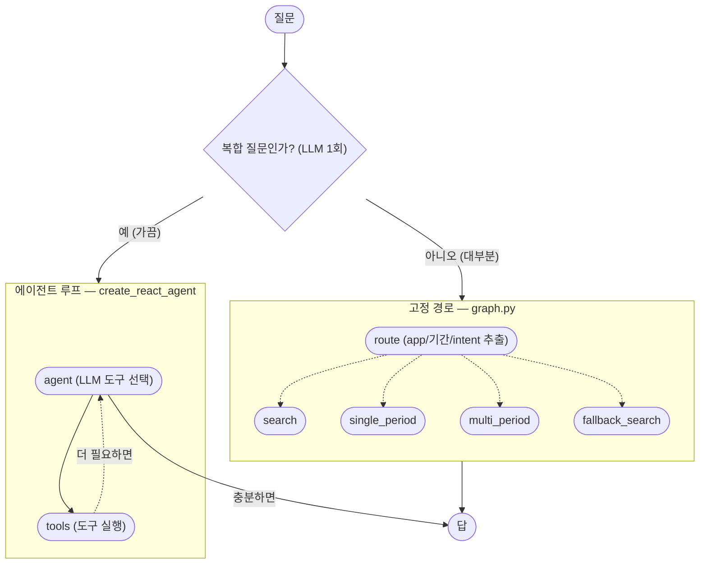

# LangGraph 구조 — screenlog_langgraph

`src/screenlog_langgraph/`가 실제로 어떻게 동작하는지 정리한 문서.
아래 다이어그램은 손으로 그린 게 아니라 컴파일된 그래프 객체에서
`get_graph().draw_mermaid()`로 뽑은 걸 그대로(또는 그걸 조합해서) 옮긴 것이다.

## 1. 2단 구조

`agent.py`가 바깥 껍데기, `graph.py`가 안쪽이다. `agent.py`의 "고정 경로" 노드는
사실 `graph.py` 전체를 그대로 한 번 호출하는 것뿐이다
([agent.py:237](../src/screenlog_langgraph/agent.py#L237)).



- **고정 경로**: `route()` 한 번으로 검색/정리/비교/집계 중 하나를 확정하고
  그대로 실행한다. 되돌아가는 화살표가 없다 — 반복 없이 한 번에 끝난다.
- **에이전트 루프**: `route()`의 4갈래로 못 답하는 "복합 질문"(예: "이번주
  유튜브 몇 번 봤는지랑 어떤 영상 봤는지 같이 알려줘"처럼 서로 다른 intent가
  둘 다 필요한 경우)만 여기로 온다. `agent`(LLM이 도구 선택) → `tools`(실제
  실행) 사이를 필요한 만큼 반복한다(`recursion_limit=8`).

**`복합 질문인가?` 판별은 별도 LLM 호출이 아니다.** 처음엔 `is_compound()`라는
전용 호출로 뽑았는데, 그러면 질문 하나마다 `route()` 1번 + 판별 1번, 최소
LLM 호출이 2번씩 들었다. `route()`가 이미 질문을 통째로 분석하는 김에
`compound` 필드 하나를 스키마에 얹어서([router.py:140-145](../src/screenlog/router.py#L140))
같은 호출에서 같이 뽑도록 합쳤다 — `classify` 노드가 `route()`를 직접
부르고, `fixed`로 가면 이미 계산된 `plan`을 `graph.py`에 그대로 넘겨서
그 안의 `route` 노드가 재계산하지 않는다([graph.py:45-51](../src/screenlog_langgraph/graph.py#L45)).
결과적으로 질문 하나당 `route()` 호출은 경로에 상관없이 **정확히 1번**이다.

이 병합에서 실제로 회귀가 하나 났었다 — 프롬프트에 "저번주 정리하고
이번주랑 비교"를 compound의 예시로 박아뒀더니, `periods=2 intent=비교`로
고정 경로가 이미 처리 가능한 이 질문까지 매번 `compound=True`로 나와서
불필요하게 비싼 에이전트로 샜다. "기간이 여러 개인 것 자체는 복합이
아니다, 서로 다른 intent가 둘 다 필요할 때만 복합이다"로 프롬프트를
고쳐서 잡았다.

세 그래프 각각을 직접 뽑아보려면:

```python
from screenlog_langgraph.agent import _graph as top, _react_agent
from screenlog_langgraph.graph import _graph as fixed

for g in (top, fixed, _react_agent):
    print(g.get_graph().draw_mermaid())
```

## 2. 노드마다 읽고 쓰는 state

LangGraph 노드는 함수 하나다 — state 딕셔너리를 받아서 일부 필드를 읽고,
바뀐 필드만 `dict`로 리턴하면 그래프가 기존 state에 병합해준다. 세 그래프는
state 스키마가 서로 다른 **별개의 상자**다 — `fixed` 노드가 `graph.py`를
부를 때도 state를 그대로 안 넘기고 `question`/`k`/`history`만 뽑아서
`graph.py` 전용 state를 새로 만든다.

| 그래프 | 노드 | 읽는 state | 새로 쓰는 state |
|---|---|---|---|
| `agent.py` | `classify` | `question`, `history` | `plan` (route() 결과, `compound` 포함) |
| `agent.py` | `fixed` | `question`, `k`, `history`, `plan` | `answer` (graph.py에 plan 그대로 넘겨 호출한 결과) |
| `agent.py` | `agent` | `question`, `history` | `answer` (react_agent 루프 결과, plan은 안 씀) |
| `graph.py` | `route` | `question`, `history` | `plan` |
| `graph.py` | `search` | `plan`, `question`, `k`, `history` | `answer`, `hits` |
| `graph.py` | `single_period` | `plan`, `question`, `history` | `answer`, `hits=None` |
| `graph.py` | `multi_period` | `plan`, `question`, `history` | `answer`, `hits=None` |
| `graph.py` | `fallback_search` | `plan`, `question`, `k`, `history` | `answer`, `hits` |
| `react_agent`(내부) | `agent`(LLM) | `messages` | `messages += AIMessage` |
| `react_agent`(내부) | `tools` | `messages`(마지막 tool_calls) | `messages += ToolMessage(들)` |

`plan`은 `route()`가 뽑는 딕셔너리로 `{app, site, hour_start, hour_end,
periods, intent, count_by_site}` 7개 필드를 갖는다
([router.py:289-298](../src/screenlog/router.py#L289)).

## 3. 실측 예시 1 — 단순 질문

**"카카오톡 몇 번 켰어?"** — 복합 판별에서 곧바로 `fixed`로 빠지는 경로.

```
진입 (agent.py State)
{"question": "카카오톡 몇 번 켰어?", "k": 5, "history": None}

classify 노드가 route()를 직접 호출한 후 (LLM 1회 — 이 호출이 전부다)
+ {"plan": {"app": "카카오톡", "site": None, "hour_start": None,
    "hour_end": None, "periods": [], "intent": "검색",
    "count_by_site": False, "compound": False}}   → fixed로 분기

fixed 노드 안에서 — graph.py의 별도 State로 재시작하되 plan을 그대로 넘김
{"question": "카카오톡 몇 번 켰어?", "k": 5, "history": None,
 "plan": {...위와 동일...}}

graph.py의 route 노드 — state에 이미 plan이 있으니 route()를 또 안 부르고 재사용

periods가 비어있고 intent=검색 → search 노드 실행 후
+ {"answer": "...", "hits": [{"start": "...", "app": "카카오톡", ...}, ...]}

fixed 노드가 이 answer만 꺼내 바깥 State에 반영
agent.py State += {"answer": "..."}   → 최종 리턴
```

## 4. 실측 예시 2 — 복합 질문

**"어제랑 오늘 작업시간만 비교해주고 오늘 유튜브 음악 들은 건 뭔지 알려주고
링크도 줘"** — `agent` 노드로 빠져서 `react_agent` 루프를 도는 경로.

```
진입 (agent.py State)
{"question": "어제랑 오늘 작업시간만 비교해주고 ...", "k": 5, "history": None}

classify 노드가 route()를 직접 호출한 후 (LLM 1회)
+ {"plan": {..., "intent": "집계", "compound": True}}   → agent로 분기
  (agent 노드는 이 plan을 안 쓴다 — 도구 인자로 스스로 다시 채운다)

agent 노드 안 — react_agent는 messages 하나만 든 완전히 별도 state
{"messages": [HumanMessage("어제랑 오늘 작업시간만 비교해주고 ...")]}

agent(LLM) 노드 1회차 실행 후 — 도구 2개 동시 호출 결정
messages += AIMessage(tool_calls=[
  compare_days(start_date="2026-08-03", end_date="2026-08-04"),
  search_events(question="유튜브에서 음악", site="YouTube",
                start_date="2026-08-04", end_date="2026-08-04")
])

tools 노드 실행 후 — 두 결과가 각각 ToolMessage로 쌓임
messages += [
  ToolMessage(name="compare_days", content="어제 5시간 / 오늘 2시간37분 ..."),
  ToolMessage(name="search_events", content="Red Velvet - Surfin Boy ...")
]

agent(LLM) 노드 2회차 — 도구 호출 없이 최종 답 작성
messages += AIMessage("## 작업시간 비교 ...", tool_calls=[])   → 루프 종료

agent 노드가 마지막 메시지만 꺼내 바깥 State에 반영
agent.py State += {"answer": messages[-1].content}   → 최종 리턴
```

이 질문 하나에 실제로 든 LLM 호출은 `route()`(판별 겸 plan 추출) 1회 +
에이전트 루프 2회(도구선택 1 + 최종정리 1)이고, `compare_days`/`search_events`
도구 **내부에서** 또 LLM을 부른다(하루 요약 2번+비교 1번, 검색 답변 작성 1번)
— 도합 약 6회. `route()`와 판별을 합치기 전엔 이보다 1회 더 들었다(판별용
`is_compound()` 별도 호출).
에이전트가 여러 도구를 병렬로 부를 때 [index.py](../src/screenlog/index.py#L59)의
`get_collection()`이 최초 생성 시점에 경쟁 상태(race condition)를 일으킨 적이
있다 — [troubleshooting-star.md #13](./troubleshooting-star.md)에 기록.
